# Mod 3 Final Project

## Student Info

- Name: Susanna Han
- Cohort: Part Time
- Instructor: James


## Introduction

Statistically analyzing the NorthWind SQL query. First, use the database below to create 4 hypotheses to help inform and give directive recommendations to the company. Then pull and organize the information needed to test the different hypotheses. Run different tests through the grouped data to reject or accept the assumptions to confirm your findings.

The different tests that are used in this project are D'Agostino-Pearson's, Levene's, Kruskal-Wallis, Statistical Power, and Tukey's Pairwise.


# PROJECT


```python
!pip install -U fsds_100719
from fsds_100719.imports import *
import pandas as pd
```

    fsds_1007219  v0.7.16 loaded.  Read the docs: https://fsds.readthedocs.io/en/latest/ 


<style  type="text/css" >
</style>  
<table id="T_ba836728_6180_11ea_b083_784f439268e3" ><caption>Loaded Packages and Handles</caption> 
<thead>    <tr> 
        <th class="col_heading level0 col0" >Handle</th> 
        <th class="col_heading level0 col1" >Package</th> 
        <th class="col_heading level0 col2" >Description</th> 
    </tr></thead> 
<tbody>    <tr> 
        <td id="T_ba836728_6180_11ea_b083_784f439268e3row0_col0" class="data row0 col0" >dp</td> 
        <td id="T_ba836728_6180_11ea_b083_784f439268e3row0_col1" class="data row0 col1" >IPython.display</td> 
        <td id="T_ba836728_6180_11ea_b083_784f439268e3row0_col2" class="data row0 col2" >Display modules with helpful display and clearing commands.</td> 
    </tr>    <tr> 
        <td id="T_ba836728_6180_11ea_b083_784f439268e3row1_col0" class="data row1 col0" >fs</td> 
        <td id="T_ba836728_6180_11ea_b083_784f439268e3row1_col1" class="data row1 col1" >fsds_100719</td> 
        <td id="T_ba836728_6180_11ea_b083_784f439268e3row1_col2" class="data row1 col2" >Custom data science bootcamp student package</td> 
    </tr>    <tr> 
        <td id="T_ba836728_6180_11ea_b083_784f439268e3row2_col0" class="data row2 col0" >mpl</td> 
        <td id="T_ba836728_6180_11ea_b083_784f439268e3row2_col1" class="data row2 col1" >matplotlib</td> 
        <td id="T_ba836728_6180_11ea_b083_784f439268e3row2_col2" class="data row2 col2" >Matplotlib's base OOP module with formatting artists</td> 
    </tr>    <tr> 
        <td id="T_ba836728_6180_11ea_b083_784f439268e3row3_col0" class="data row3 col0" >plt</td> 
        <td id="T_ba836728_6180_11ea_b083_784f439268e3row3_col1" class="data row3 col1" >matplotlib.pyplot</td> 
        <td id="T_ba836728_6180_11ea_b083_784f439268e3row3_col2" class="data row3 col2" >Matplotlib's matlab-like plotting module</td> 
    </tr>    <tr> 
        <td id="T_ba836728_6180_11ea_b083_784f439268e3row4_col0" class="data row4 col0" >np</td> 
        <td id="T_ba836728_6180_11ea_b083_784f439268e3row4_col1" class="data row4 col1" >numpy</td> 
        <td id="T_ba836728_6180_11ea_b083_784f439268e3row4_col2" class="data row4 col2" >scientific computing with Python</td> 
    </tr>    <tr> 
        <td id="T_ba836728_6180_11ea_b083_784f439268e3row5_col0" class="data row5 col0" >pd</td> 
        <td id="T_ba836728_6180_11ea_b083_784f439268e3row5_col1" class="data row5 col1" >pandas</td> 
        <td id="T_ba836728_6180_11ea_b083_784f439268e3row5_col2" class="data row5 col2" >High performance data structures and tools</td> 
    </tr>    <tr> 
        <td id="T_ba836728_6180_11ea_b083_784f439268e3row6_col0" class="data row6 col0" >sns</td> 
        <td id="T_ba836728_6180_11ea_b083_784f439268e3row6_col1" class="data row6 col1" >seaborn</td> 
        <td id="T_ba836728_6180_11ea_b083_784f439268e3row6_col2" class="data row6 col2" >High-level data visualization library based on matplotlib</td> 
    </tr></tbody> 
</table> 


<script type="text/javascript">
window.PlotlyConfig = {MathJaxConfig: 'local'};
if (window.MathJax) {MathJax.Hub.Config({SVG: {font: "STIX-Web"}});}
if (typeof require !== 'undefined') {
require.undef("plotly");
requirejs.config({
    paths: {
        'plotly': ['https://cdn.plot.ly/plotly-latest.min']
    }
});
require(['plotly'], function(Plotly) {
    window._Plotly = Plotly;
});
}
</script>


    [i] Pandas .iplot() method activated.


```python
import pandas as pd
import scipy.stats as stats
import pandas as pd
import numpy as np
import warnings
```


```python
warnings.filterwarnings('ignore')
```


```python
def Cohen_d(group1, group2, correction = False):
    """Compute Cohen's d
    d = (group1.mean()-group2.mean())/pool_variance.
    pooled_variance= (n1 * var1 + n2 * var2) / (n1 + n2)

    Args:
        group1 (Series or NumPy array): group 1 for calculating d
        group2 (Series or NumPy array): group 2 for calculating d
        correction (bool): Apply equation correction if N<50. Default is False. 
            - Url with small ncorrection equation: 
                - https://www.statisticshowto.datasciencecentral.com/cohens-d/ 
    Returns:
        d (float): calculated d value
         
    INTERPRETATION OF COHEN's D: 
    > Small effect = 0.2
    > Medium Effect = 0.5
    > Large Effect = 0.8
    
    """
    import scipy.stats as stats
    import scipy   
    import numpy as np
    N = len(group1)+len(group2)
    diff = group1.mean() - group2.mean()

    n1, n2 = len(group1), len(group2)
    var1 = group1.var()
    var2 = group2.var()

    # Calculate the pooled threshold as shown earlier
    pooled_var = (n1 * var1 + n2 * var2) / (n1 + n2)
    
    # Calculate Cohen's d statistic
    d = diff / np.sqrt(pooled_var)
    
    ## Apply correction if needed
    if (N < 50) & (correction==True):
        d=d * ((N-3)/(N-2.25))*np.sqrt((N-2)/N)
    return d


#Your code here
def find_outliers_z(data):
    """Use scipy to calculate absolute Z-scores 
    and return boolean series where True indicates it is an outlier.

    Args:
        data (Series,or ndarray): data to test for outliers.

    Returns:
        [boolean Series]: A True/False for each row use to slice outliers.
        
    EXAMPLE USE: 
    >> idx_outs = find_outliers_df(df['AdjustedCompensation'])
    >> good_data = df[~idx_outs].copy()
    """
    import pandas as pd
    import numpy as np
    import scipy.stats as stats
    import pandas as pd
    import numpy as np
    ## Calculate z-scores
    zs = stats.zscore(data)
    
    ## Find z-scores >3 awayfrom mean
    idx_outs = np.abs(zs)>3
    
    ## If input was a series, make idx_outs index match
    if isinstance(data,pd.Series):
        return pd.Series(idx_outs,index=data.index)
    else:
        return pd.Series(idx_outs)
    
    
    
def find_outliers_IQR(data):
    """Use Tukey's Method of outlier removal AKA InterQuartile-Range Rule
    and return boolean series where True indicates it is an outlier.
    - Calculates the range between the 75% and 25% quartiles
    - Outliers fall outside upper and lower limits, using a treshold of  1.5*IQR the 75% and 25% quartiles.

    IQR Range Calculation:    
        res = df.describe()
        IQR = res['75%'] -  res['25%']
        lower_limit = res['25%'] - 1.5*IQR
        upper_limit = res['75%'] + 1.5*IQR

    Args:
        data (Series,or ndarray): data to test for outliers.

    Returns:
        [boolean Series]: A True/False for each row use to slice outliers.
        
    EXAMPLE USE: 
    >> idx_outs = find_outliers_df(df['AdjustedCompensation'])
    >> good_data = df[~idx_outs].copy()
    
    """
    df_b=data
    res= df_b.describe()

    IQR = res['75%'] -  res['25%']
    lower_limit = res['25%'] - 1.5*IQR
    upper_limit = res['75%'] + 1.5*IQR

    idx_outs = (df_b>upper_limit) | (df_b<lower_limit)

    return idx_outs


def prep_data_for_tukeys(data):
    """Accepts a dictionary with group names as the keys 
    and pandas series as the values. 
    
    Returns a dataframe ready for tukeys test:
    - with a 'data' column and a 'group' column for sms.stats.multicomp.pairwise_tukeyhsd 
    
    Example Use:
    df_tukey = prep_data_for_tukeys(grp_data)
    tukey = sms.stats.multicomp.pairwise_tukeyhsd(df_tukey['data'], df_tukey['group'])
    tukey.summary()
    """
    
    df_tukey = pd.DataFrame(columns=['data','group'])
    for k,v in  data.items():
        grp_df = v.rename('data').to_frame() 
        grp_df['group'] = k
        df_tukey=pd.concat([df_tukey, grp_df],axis=0)

	## New lines added to ensure compatibility with tukey's test
    df_tukey['group'] = df_tukey['group'].astype('str')
    df_tukey['data'] = df_tukey['data'].astype('float')
    return df_tukey

```


```python
import sqlite3
connect = sqlite3.connect('Northwind_small.sqlite')
cur = connect.cursor()
```


```python
## To see all tables
cur.execute("""SELECT name FROM sqlite_master WHERE type='table';""")
df_tables = pd.DataFrame(cur.fetchall(), columns=['Table'])
df_tables
```


<div>
<style scoped>
    .dataframe tbody tr th:only-of-type {
        vertical-align: middle;
    }

    .dataframe tbody tr th {
        vertical-align: top;
    }

    .dataframe thead th {
        text-align: right;
    }
</style>
<table border="1" class="dataframe">
  <thead>
    <tr style="text-align: right;">
      <th></th>
      <th>Table</th>
    </tr>
  </thead>
  <tbody>
    <tr>
      <th>0</th>
      <td>Employee</td>
    </tr>
    <tr>
      <th>1</th>
      <td>Category</td>
    </tr>
    <tr>
      <th>2</th>
      <td>Customer</td>
    </tr>
    <tr>
      <th>3</th>
      <td>Shipper</td>
    </tr>
    <tr>
      <th>4</th>
      <td>Supplier</td>
    </tr>
    <tr>
      <th>5</th>
      <td>Order</td>
    </tr>
    <tr>
      <th>6</th>
      <td>Product</td>
    </tr>
    <tr>
      <th>7</th>
      <td>OrderDetail</td>
    </tr>
    <tr>
      <th>8</th>
      <td>CustomerCustomerDemo</td>
    </tr>
    <tr>
      <th>9</th>
      <td>CustomerDemographic</td>
    </tr>
    <tr>
      <th>10</th>
      <td>Region</td>
    </tr>
    <tr>
      <th>11</th>
      <td>Territory</td>
    </tr>
    <tr>
      <th>12</th>
      <td>EmployeeTerritory</td>
    </tr>
  </tbody>
</table>
</div>


# Hypothesis 1

> Does discount amount have a statistically significant effect on the quantity of a product in an order? If so, at what level(s) of discount?

- $H_0$: The customer orders the same quantity of a product whether it's discounted or full price. 
- $H_A$: The customer orders more or less of a product whether it's discounted or full price.

First explore the data and pull in the information needed to test the hypothesis. A discount group column was created to translate the bool into words to define the content in a more clear way. (Discounted or Full Price) This helps for future references without remembering which was True and False. After gathering the information you will be using a bar graph to have a general visual of the dataset pulled. 


```python
cur.execute('''SELECT * from OrderDetail''')
col_names = [x[0] for x in cur.description]
col_names
```


    ['Id', 'OrderId', 'ProductId', 'UnitPrice', 'Quantity', 'Discount']


```python
df = pd.DataFrame(cur.fetchall(), columns = col_names)
df.head()
```


<div>
<style scoped>
    .dataframe tbody tr th:only-of-type {
        vertical-align: middle;
    }

    .dataframe tbody tr th {
        vertical-align: top;
    }

    .dataframe thead th {
        text-align: right;
    }
</style>
<table border="1" class="dataframe">
  <thead>
    <tr style="text-align: right;">
      <th></th>
      <th>Id</th>
      <th>OrderId</th>
      <th>ProductId</th>
      <th>UnitPrice</th>
      <th>Quantity</th>
      <th>Discount</th>
    </tr>
  </thead>
  <tbody>
    <tr>
      <th>0</th>
      <td>10248/11</td>
      <td>10248</td>
      <td>11</td>
      <td>14.0</td>
      <td>12</td>
      <td>0.0</td>
    </tr>
    <tr>
      <th>1</th>
      <td>10248/42</td>
      <td>10248</td>
      <td>42</td>
      <td>9.8</td>
      <td>10</td>
      <td>0.0</td>
    </tr>
    <tr>
      <th>2</th>
      <td>10248/72</td>
      <td>10248</td>
      <td>72</td>
      <td>34.8</td>
      <td>5</td>
      <td>0.0</td>
    </tr>
    <tr>
      <th>3</th>
      <td>10249/14</td>
      <td>10249</td>
      <td>14</td>
      <td>18.6</td>
      <td>9</td>
      <td>0.0</td>
    </tr>
    <tr>
      <th>4</th>
      <td>10249/51</td>
      <td>10249</td>
      <td>51</td>
      <td>42.4</td>
      <td>40</td>
      <td>0.0</td>
    </tr>
  </tbody>
</table>
</div>


```python
df['Discount_grp'] = df['Discount'] > 0
df['Discount_grp'] = df['Discount_grp'].map({True:'Discounted', False: 'Full Price'})
df
```


<div>
<style scoped>
    .dataframe tbody tr th:only-of-type {
        vertical-align: middle;
    }

    .dataframe tbody tr th {
        vertical-align: top;
    }

    .dataframe thead th {
        text-align: right;
    }
</style>
<table border="1" class="dataframe">
  <thead>
    <tr style="text-align: right;">
      <th></th>
      <th>Id</th>
      <th>OrderId</th>
      <th>ProductId</th>
      <th>UnitPrice</th>
      <th>Quantity</th>
      <th>Discount</th>
      <th>Discount_grp</th>
    </tr>
  </thead>
  <tbody>
    <tr>
      <th>0</th>
      <td>10248/11</td>
      <td>10248</td>
      <td>11</td>
      <td>14.00</td>
      <td>12</td>
      <td>0.00</td>
      <td>Full Price</td>
    </tr>
    <tr>
      <th>1</th>
      <td>10248/42</td>
      <td>10248</td>
      <td>42</td>
      <td>9.80</td>
      <td>10</td>
      <td>0.00</td>
      <td>Full Price</td>
    </tr>
    <tr>
      <th>2</th>
      <td>10248/72</td>
      <td>10248</td>
      <td>72</td>
      <td>34.80</td>
      <td>5</td>
      <td>0.00</td>
      <td>Full Price</td>
    </tr>
    <tr>
      <th>3</th>
      <td>10249/14</td>
      <td>10249</td>
      <td>14</td>
      <td>18.60</td>
      <td>9</td>
      <td>0.00</td>
      <td>Full Price</td>
    </tr>
    <tr>
      <th>4</th>
      <td>10249/51</td>
      <td>10249</td>
      <td>51</td>
      <td>42.40</td>
      <td>40</td>
      <td>0.00</td>
      <td>Full Price</td>
    </tr>
    <tr>
      <th>5</th>
      <td>10250/41</td>
      <td>10250</td>
      <td>41</td>
      <td>7.70</td>
      <td>10</td>
      <td>0.00</td>
      <td>Full Price</td>
    </tr>
    <tr>
      <th>6</th>
      <td>10250/51</td>
      <td>10250</td>
      <td>51</td>
      <td>42.40</td>
      <td>35</td>
      <td>0.15</td>
      <td>Discounted</td>
    </tr>
    <tr>
      <th>7</th>
      <td>10250/65</td>
      <td>10250</td>
      <td>65</td>
      <td>16.80</td>
      <td>15</td>
      <td>0.15</td>
      <td>Discounted</td>
    </tr>
    <tr>
      <th>8</th>
      <td>10251/22</td>
      <td>10251</td>
      <td>22</td>
      <td>16.80</td>
      <td>6</td>
      <td>0.05</td>
      <td>Discounted</td>
    </tr>
    <tr>
      <th>9</th>
      <td>10251/57</td>
      <td>10251</td>
      <td>57</td>
      <td>15.60</td>
      <td>15</td>
      <td>0.05</td>
      <td>Discounted</td>
    </tr>
    <tr>
      <th>10</th>
      <td>10251/65</td>
      <td>10251</td>
      <td>65</td>
      <td>16.80</td>
      <td>20</td>
      <td>0.00</td>
      <td>Full Price</td>
    </tr>
    <tr>
      <th>11</th>
      <td>10252/20</td>
      <td>10252</td>
      <td>20</td>
      <td>64.80</td>
      <td>40</td>
      <td>0.05</td>
      <td>Discounted</td>
    </tr>
    <tr>
      <th>12</th>
      <td>10252/33</td>
      <td>10252</td>
      <td>33</td>
      <td>2.00</td>
      <td>25</td>
      <td>0.05</td>
      <td>Discounted</td>
    </tr>
    <tr>
      <th>13</th>
      <td>10252/60</td>
      <td>10252</td>
      <td>60</td>
      <td>27.20</td>
      <td>40</td>
      <td>0.00</td>
      <td>Full Price</td>
    </tr>
    <tr>
      <th>14</th>
      <td>10253/31</td>
      <td>10253</td>
      <td>31</td>
      <td>10.00</td>
      <td>20</td>
      <td>0.00</td>
      <td>Full Price</td>
    </tr>
    <tr>
      <th>15</th>
      <td>10253/39</td>
      <td>10253</td>
      <td>39</td>
      <td>14.40</td>
      <td>42</td>
      <td>0.00</td>
      <td>Full Price</td>
    </tr>
    <tr>
      <th>16</th>
      <td>10253/49</td>
      <td>10253</td>
      <td>49</td>
      <td>16.00</td>
      <td>40</td>
      <td>0.00</td>
      <td>Full Price</td>
    </tr>
    <tr>
      <th>17</th>
      <td>10254/24</td>
      <td>10254</td>
      <td>24</td>
      <td>3.60</td>
      <td>15</td>
      <td>0.15</td>
      <td>Discounted</td>
    </tr>
    <tr>
      <th>18</th>
      <td>10254/55</td>
      <td>10254</td>
      <td>55</td>
      <td>19.20</td>
      <td>21</td>
      <td>0.15</td>
      <td>Discounted</td>
    </tr>
    <tr>
      <th>19</th>
      <td>10254/74</td>
      <td>10254</td>
      <td>74</td>
      <td>8.00</td>
      <td>21</td>
      <td>0.00</td>
      <td>Full Price</td>
    </tr>
    <tr>
      <th>20</th>
      <td>10255/2</td>
      <td>10255</td>
      <td>2</td>
      <td>15.20</td>
      <td>20</td>
      <td>0.00</td>
      <td>Full Price</td>
    </tr>
    <tr>
      <th>21</th>
      <td>10255/16</td>
      <td>10255</td>
      <td>16</td>
      <td>13.90</td>
      <td>35</td>
      <td>0.00</td>
      <td>Full Price</td>
    </tr>
    <tr>
      <th>22</th>
      <td>10255/36</td>
      <td>10255</td>
      <td>36</td>
      <td>15.20</td>
      <td>25</td>
      <td>0.00</td>
      <td>Full Price</td>
    </tr>
    <tr>
      <th>23</th>
      <td>10255/59</td>
      <td>10255</td>
      <td>59</td>
      <td>44.00</td>
      <td>30</td>
      <td>0.00</td>
      <td>Full Price</td>
    </tr>
    <tr>
      <th>24</th>
      <td>10256/53</td>
      <td>10256</td>
      <td>53</td>
      <td>26.20</td>
      <td>15</td>
      <td>0.00</td>
      <td>Full Price</td>
    </tr>
    <tr>
      <th>25</th>
      <td>10256/77</td>
      <td>10256</td>
      <td>77</td>
      <td>10.40</td>
      <td>12</td>
      <td>0.00</td>
      <td>Full Price</td>
    </tr>
    <tr>
      <th>26</th>
      <td>10257/27</td>
      <td>10257</td>
      <td>27</td>
      <td>35.10</td>
      <td>25</td>
      <td>0.00</td>
      <td>Full Price</td>
    </tr>
    <tr>
      <th>27</th>
      <td>10257/39</td>
      <td>10257</td>
      <td>39</td>
      <td>14.40</td>
      <td>6</td>
      <td>0.00</td>
      <td>Full Price</td>
    </tr>
    <tr>
      <th>28</th>
      <td>10257/77</td>
      <td>10257</td>
      <td>77</td>
      <td>10.40</td>
      <td>15</td>
      <td>0.00</td>
      <td>Full Price</td>
    </tr>
    <tr>
      <th>29</th>
      <td>10258/2</td>
      <td>10258</td>
      <td>2</td>
      <td>15.20</td>
      <td>50</td>
      <td>0.20</td>
      <td>Discounted</td>
    </tr>
    <tr>
      <th>...</th>
      <td>...</td>
      <td>...</td>
      <td>...</td>
      <td>...</td>
      <td>...</td>
      <td>...</td>
      <td>...</td>
    </tr>
    <tr>
      <th>2125</th>
      <td>11075/46</td>
      <td>11075</td>
      <td>46</td>
      <td>12.00</td>
      <td>30</td>
      <td>0.15</td>
      <td>Discounted</td>
    </tr>
    <tr>
      <th>2126</th>
      <td>11075/76</td>
      <td>11075</td>
      <td>76</td>
      <td>18.00</td>
      <td>2</td>
      <td>0.15</td>
      <td>Discounted</td>
    </tr>
    <tr>
      <th>2127</th>
      <td>11076/6</td>
      <td>11076</td>
      <td>6</td>
      <td>25.00</td>
      <td>20</td>
      <td>0.25</td>
      <td>Discounted</td>
    </tr>
    <tr>
      <th>2128</th>
      <td>11076/14</td>
      <td>11076</td>
      <td>14</td>
      <td>23.25</td>
      <td>20</td>
      <td>0.25</td>
      <td>Discounted</td>
    </tr>
    <tr>
      <th>2129</th>
      <td>11076/19</td>
      <td>11076</td>
      <td>19</td>
      <td>9.20</td>
      <td>10</td>
      <td>0.25</td>
      <td>Discounted</td>
    </tr>
    <tr>
      <th>2130</th>
      <td>11077/2</td>
      <td>11077</td>
      <td>2</td>
      <td>19.00</td>
      <td>24</td>
      <td>0.20</td>
      <td>Discounted</td>
    </tr>
    <tr>
      <th>2131</th>
      <td>11077/3</td>
      <td>11077</td>
      <td>3</td>
      <td>10.00</td>
      <td>4</td>
      <td>0.00</td>
      <td>Full Price</td>
    </tr>
    <tr>
      <th>2132</th>
      <td>11077/4</td>
      <td>11077</td>
      <td>4</td>
      <td>22.00</td>
      <td>1</td>
      <td>0.00</td>
      <td>Full Price</td>
    </tr>
    <tr>
      <th>2133</th>
      <td>11077/6</td>
      <td>11077</td>
      <td>6</td>
      <td>25.00</td>
      <td>1</td>
      <td>0.02</td>
      <td>Discounted</td>
    </tr>
    <tr>
      <th>2134</th>
      <td>11077/7</td>
      <td>11077</td>
      <td>7</td>
      <td>30.00</td>
      <td>1</td>
      <td>0.05</td>
      <td>Discounted</td>
    </tr>
    <tr>
      <th>2135</th>
      <td>11077/8</td>
      <td>11077</td>
      <td>8</td>
      <td>40.00</td>
      <td>2</td>
      <td>0.10</td>
      <td>Discounted</td>
    </tr>
    <tr>
      <th>2136</th>
      <td>11077/10</td>
      <td>11077</td>
      <td>10</td>
      <td>31.00</td>
      <td>1</td>
      <td>0.00</td>
      <td>Full Price</td>
    </tr>
    <tr>
      <th>2137</th>
      <td>11077/12</td>
      <td>11077</td>
      <td>12</td>
      <td>38.00</td>
      <td>2</td>
      <td>0.05</td>
      <td>Discounted</td>
    </tr>
    <tr>
      <th>2138</th>
      <td>11077/13</td>
      <td>11077</td>
      <td>13</td>
      <td>6.00</td>
      <td>4</td>
      <td>0.00</td>
      <td>Full Price</td>
    </tr>
    <tr>
      <th>2139</th>
      <td>11077/14</td>
      <td>11077</td>
      <td>14</td>
      <td>23.25</td>
      <td>1</td>
      <td>0.03</td>
      <td>Discounted</td>
    </tr>
    <tr>
      <th>2140</th>
      <td>11077/16</td>
      <td>11077</td>
      <td>16</td>
      <td>17.45</td>
      <td>2</td>
      <td>0.03</td>
      <td>Discounted</td>
    </tr>
    <tr>
      <th>2141</th>
      <td>11077/20</td>
      <td>11077</td>
      <td>20</td>
      <td>81.00</td>
      <td>1</td>
      <td>0.04</td>
      <td>Discounted</td>
    </tr>
    <tr>
      <th>2142</th>
      <td>11077/23</td>
      <td>11077</td>
      <td>23</td>
      <td>9.00</td>
      <td>2</td>
      <td>0.00</td>
      <td>Full Price</td>
    </tr>
    <tr>
      <th>2143</th>
      <td>11077/32</td>
      <td>11077</td>
      <td>32</td>
      <td>32.00</td>
      <td>1</td>
      <td>0.00</td>
      <td>Full Price</td>
    </tr>
    <tr>
      <th>2144</th>
      <td>11077/39</td>
      <td>11077</td>
      <td>39</td>
      <td>18.00</td>
      <td>2</td>
      <td>0.05</td>
      <td>Discounted</td>
    </tr>
    <tr>
      <th>2145</th>
      <td>11077/41</td>
      <td>11077</td>
      <td>41</td>
      <td>9.65</td>
      <td>3</td>
      <td>0.00</td>
      <td>Full Price</td>
    </tr>
    <tr>
      <th>2146</th>
      <td>11077/46</td>
      <td>11077</td>
      <td>46</td>
      <td>12.00</td>
      <td>3</td>
      <td>0.02</td>
      <td>Discounted</td>
    </tr>
    <tr>
      <th>2147</th>
      <td>11077/52</td>
      <td>11077</td>
      <td>52</td>
      <td>7.00</td>
      <td>2</td>
      <td>0.00</td>
      <td>Full Price</td>
    </tr>
    <tr>
      <th>2148</th>
      <td>11077/55</td>
      <td>11077</td>
      <td>55</td>
      <td>24.00</td>
      <td>2</td>
      <td>0.00</td>
      <td>Full Price</td>
    </tr>
    <tr>
      <th>2149</th>
      <td>11077/60</td>
      <td>11077</td>
      <td>60</td>
      <td>34.00</td>
      <td>2</td>
      <td>0.06</td>
      <td>Discounted</td>
    </tr>
    <tr>
      <th>2150</th>
      <td>11077/64</td>
      <td>11077</td>
      <td>64</td>
      <td>33.25</td>
      <td>2</td>
      <td>0.03</td>
      <td>Discounted</td>
    </tr>
    <tr>
      <th>2151</th>
      <td>11077/66</td>
      <td>11077</td>
      <td>66</td>
      <td>17.00</td>
      <td>1</td>
      <td>0.00</td>
      <td>Full Price</td>
    </tr>
    <tr>
      <th>2152</th>
      <td>11077/73</td>
      <td>11077</td>
      <td>73</td>
      <td>15.00</td>
      <td>2</td>
      <td>0.01</td>
      <td>Discounted</td>
    </tr>
    <tr>
      <th>2153</th>
      <td>11077/75</td>
      <td>11077</td>
      <td>75</td>
      <td>7.75</td>
      <td>4</td>
      <td>0.00</td>
      <td>Full Price</td>
    </tr>
    <tr>
      <th>2154</th>
      <td>11077/77</td>
      <td>11077</td>
      <td>77</td>
      <td>13.00</td>
      <td>2</td>
      <td>0.00</td>
      <td>Full Price</td>
    </tr>
  </tbody>
</table>
<p>2155 rows × 7 columns</p>
</div>


A bar graph was created comparing the different discount amounts with the number of products bought to see a general comparison. 


```python
sns.barplot(data=df, x = df['Discount'], y= df['Quantity'], ci=68);
```


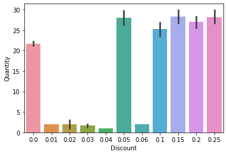


The quantity of products are then grouped into the same discount categories as seen above. Then a subplot is made with the multiple discounted groups to show a general distribution of the number of products sold at a certain discount percentage. (Shown Below)


```python
discounts = {}
for discount_grps in df['Discount'].unique():
    discounts[discount_grps]= df.groupby('Discount').get_group(discount_grps)['Quantity']
discounts
```


    {0.0: 0        12
     1        10
     2         5
     3         9
     4        40
     5        10
     10       20
     13       40
     14       20
     15       42
     16       40
     19       21
     20       20
     21       35
     22       25
     23       30
     24       15
     25       12
     26       25
     27        6
     28       15
     32       10
     33        1
     35       50
     38       20
     39       20
     41       15
     42        2
     44       28
     47       35
            ... 
     2088      4
     2089     10
     2090     15
     2093     30
     2097     12
     2100     55
     2103      3
     2104     42
     2105     35
     2106      9
     2110     20
     2114     20
     2117      8
     2118     40
     2119     22
     2120    130
     2121     10
     2122     20
     2131      4
     2132      1
     2136      1
     2138      4
     2142      2
     2143      1
     2145      3
     2147      2
     2148      2
     2151      1
     2153      4
     2154      2
     Name: Quantity, Length: 1317, dtype: int64, 0.15: 6       35
     7       15
     17      15
     18      21
     48      25
     53      70
     54      15
     104     40
     106     15
     196     21
     197     70
     199     40
     200     80
     220     50
     221     25
     250      9
     266     50
     268      6
     269     15
     279     20
     326     15
     328     20
     341     20
     342     20
     397     10
     398     18
     414     21
     415     70
     463      4
     465     15
             ..
     1757    12
     1774    42
     1793    10
     1794    40
     1829    28
     1830    25
     1832    24
     1843    20
     1853     2
     1859    12
     1860    12
     1882    20
     1883    40
     1885     6
     1896    84
     1917    60
     1918    65
     1919    66
     1948    15
     1949    24
     1993    24
     2107     8
     2108    36
     2109    28
     2111    40
     2112    20
     2113    30
     2124    10
     2125    30
     2126     2
     Name: Quantity, Length: 157, dtype: int64, 0.05: 8         6
     9        15
     11       40
     12       25
     51       12
     57       60
     58       20
     65       24
     66       15
     68       60
     69       33
     72       12
     73        6
     216      10
     217       8
     218      20
     219      12
     244      70
     246      20
     247      12
     248      40
     256       4
     274      20
     276      77
     277      10
     292      10
     293      10
     294      20
     295      56
     296      70
            ... 
     1691    120
     1712     20
     1715     20
     1716     14
     1822     15
     1823      6
     1824     50
     1825     16
     1827     50
     1828     50
     1846      6
     1926     18
     1937     20
     1938     15
     1939     21
     1963     70
     1964     90
     1971     40
     1973     50
     1974     36
     1975     60
     2057     20
     2058     15
     2059     18
     2115     15
     2116     10
     2123     14
     2134      1
     2137      2
     2144      2
     Name: Quantity, Length: 185, dtype: int64, 0.2: 29      50
     30      65
     31       6
     40      12
     99      45
     100     40
     101     36
     209     25
     210     50
     211     35
     212     30
     223     40
     224     10
     225     16
     231      7
     232     25
     233      6
     234     48
     251     24
     252     56
     253     40
     254     40
     280     12
     281     50
     289     30
     291      8
     329      6
     334     80
     335     50
     362     10
             ..
     1572    36
     1573    45
     1574    55
     1656    30
     1657    30
     1658    50
     1750    10
     1751    10
     1752    24
     1772    25
     1773    30
     1786    30
     1833    12
     1867    40
     1892    40
     1920    50
     1921    20
     1922    90
     2041     5
     2049    30
     2063    10
     2064     4
     2066    10
     2067    30
     2068    10
     2069    35
     2071    25
     2091    10
     2092    12
     2130    24
     Name: Quantity, Length: 161, dtype: int64, 0.25: 34       16
     36       15
     37       21
     43       60
     45       60
     46       36
     82       15
     95       15
     97       20
     98        5
     135      40
     136      30
     259      70
     325      18
     330      12
     331      40
     332      70
     333      42
     384      25
     385      42
     386       7
     387      70
     450       2
     451      36
     473      10
     474      20
     480      35
     485      50
     486      50
     487      30
            ... 
     1791     49
     1792     35
     1797     44
     1798     30
     1799     80
     1805      5
     1806     18
     1844     10
     1924     50
     1925     35
     1931     20
     1932     20
     1940     25
     1941     30
     1959      2
     1967     18
     1994     11
     1997     44
     2011     30
     2012     21
     2017    100
     2019     60
     2020    100
     2060     25
     2061     30
     2101      4
     2102     20
     2127     20
     2128     20
     2129     10
     Name: Quantity, Length: 154, dtype: int64, 0.1: 107     10
     108      3
     115     20
     116     24
     117      2
     147     40
     148     30
     149     15
     153     25
     154     25
     155     30
     177     40
     178     30
     179     25
     227     10
     228     40
     235     18
     263     36
     272     15
     273     18
     303     54
     304     55
     320      5
     321     13
     323     35
     344      8
     345     16
     346     20
     347     18
     348     20
             ..
     1547    30
     1548    15
     1561    70
     1562    25
     1563    42
     1564    60
     1628    42
     1646    21
     1753    20
     1754    30
     1776    30
     1777    14
     1779    20
     1901    36
     1902     8
     1903    35
     1912    40
     1980    28
     2007    10
     2008    20
     2029    70
     2030    36
     2031    15
     2065    50
     2094    40
     2095    30
     2096    77
     2098    25
     2099     4
     2135     2
     Name: Quantity, Length: 173, dtype: int64, 0.02: 2133    1
     2146    3
     Name: Quantity, dtype: int64, 0.03: 2139    1
     2140    2
     2150    2
     Name: Quantity, dtype: int64, 0.04: 2141    1
     Name: Quantity, dtype: int64, 0.06: 2149    2
     Name: Quantity, dtype: int64, 0.01: 2152    2
     Name: Quantity, dtype: int64}


```python
fig, ax=plt.subplots(figsize = (8,5))
for discount_grps, grp_data in discounts.items():
    sns.distplot(grp_data, label=discount_grps, ax=ax)
ax.legend()
ax.set(title ='Quantity by Discounted Group', ylabel = 'Density');
```


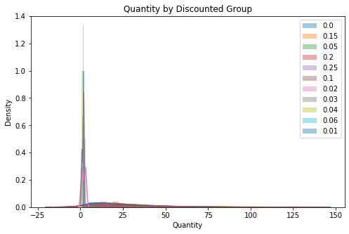


The idx_outs function is used to find and delete outliers using z-scores. Another subplot graph is then created to see the difference once the outliers found are gone. We can see a slightly more normal distribution in the graph below.


```python
for discount_grps, grp_data in discounts.items():
    idx_outs = find_outliers_z(grp_data)
    print(f'I found {idx_outs.sum()} outliers in {discount_grps} using z-scores')
    discounts[discount_grps] = grp_data[-idx_outs]
```

    I found 20 outliers in 0.0 using z-scores
    I found 2 outliers in 0.15 using z-scores
    I found 3 outliers in 0.05 using z-scores
    I found 2 outliers in 0.2 using z-scores
    I found 3 outliers in 0.25 using z-scores
    I found 3 outliers in 0.1 using z-scores
    I found 0 outliers in 0.02 using z-scores
    I found 0 outliers in 0.03 using z-scores
    I found 0 outliers in 0.04 using z-scores
    I found 0 outliers in 0.06 using z-scores
    I found 0 outliers in 0.01 using z-scores


```python
fig, ax=plt.subplots(figsize = (8,5))
for discount_grps, grp_data in discounts.items():
    sns.distplot(grp_data, label=discount_grps, ax=ax )
ax.legend()
ax.set(title ='Quantity by Discounted Group', ylabel = 'Density');
```


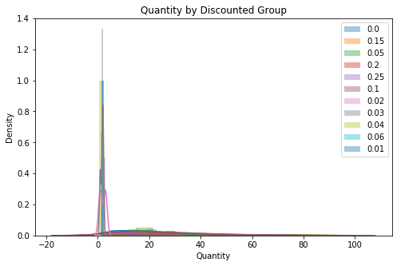


The discount percentages that do not have enough data are then taken out of the dataset using a for loop to find the small categories. The other discount categories with more than 8 data points are then shown with a p-value < 0.05 Therefore the data is not normal but because the size of the data. The results of the normal test is ignored. Therefore, moving on to test the equal variance using the levene's test. The results are shown below.


```python
for k,v in discounts.items():
    if len(v) > 8: 
        stat,p = stats.normaltest(v)
        print(f"The {k} Normaltest p-value = {round(p,4)}")
    else: 
        print(f"The column {k} is too small.")
```

    The 0.0 Normaltest p-value = 0.0
    The 0.15 Normaltest p-value = 0.0
    The 0.05 Normaltest p-value = 0.0
    The 0.2 Normaltest p-value = 0.0005
    The 0.25 Normaltest p-value = 0.0013
    The 0.1 Normaltest p-value = 0.0
    The column 0.02 is too small.
    The column 0.03 is too small.
    The column 0.04 is too small.
    The column 0.06 is too small.
    The column 0.01 is too small.


```python
toosmall = (0.02, 0.03, 0.04, 0.06, 0.01)
for key in toosmall:
    discounts.pop(key)
```


```python
for k,v in discounts.items():
    print(f"There are {len(v)} in group {k}.")
```

    There are 1297 in group 0.0.
    There are 155 in group 0.15.
    There are 182 in group 0.05.
    There are 159 in group 0.2.
    There are 151 in group 0.25.
    There are 170 in group 0.1.


```python
data = []
for k,v in discounts.items():
    data.append(v)
data[0]
```


    0       12
    1       10
    2        5
    3        9
    4       40
    5       10
    10      20
    13      40
    14      20
    15      42
    16      40
    19      21
    20      20
    21      35
    22      25
    23      30
    24      15
    25      12
    26      25
    27       6
    28      15
    32      10
    33       1
    35      50
    38      20
    39      20
    41      15
    42       2
    44      28
    47      35
            ..
    2087    35
    2088     4
    2089    10
    2090    15
    2093    30
    2097    12
    2100    55
    2103     3
    2104    42
    2105    35
    2106     9
    2110    20
    2114    20
    2117     8
    2118    40
    2119    22
    2121    10
    2122    20
    2131     4
    2132     1
    2136     1
    2138     4
    2142     2
    2143     1
    2145     3
    2147     2
    2148     2
    2151     1
    2153     4
    2154     2
    Name: Quantity, Length: 1297, dtype: int64


```python
stat,p = stats.levene(*data) 
print(f"Levene's test for equal variance p-value ={round(p,4)} therefore it does not have equal variance.")
```

    Levene's test for equal variance p-value =0.0003 therefore it does not have equal variance.


To test the hypothesis the Kruskal-Wallis method is used to calculate the p-value. Results shown below.


```python
stat,p = stats.kruskal(*data)
print(f'Kruskal-Wallis t-test p-value ={round(p,4)} therefore the alternative hypothesis is statistically significance.')
```

    Kruskal-Wallis t-test p-value =0.0 therefore the alternative hypothesis is statistically significance.


With multiple different discount percentages a tukey's test is done to see which groups are significantly different between the amount of items sold correlated with at which the discount was given. A matrix table was then created comparing each group with another showing the mean difference.


```python
df_tukeys = prep_data_for_tukeys(discounts)
df_tukeys.head()
df_tukeys.columns = ['Quantity','Discount']
```


```python
from statsmodels.stats.multicomp import pairwise_tukeyhsd
model= pairwise_tukeyhsd(df_tukeys['Quantity'],df_tukeys['Discount'])
model.summary()
df = pd.DataFrame(data=model._results_table.data[1:], columns=model._results_table.data[0])
df
```


<div>
<style scoped>
    .dataframe tbody tr th:only-of-type {
        vertical-align: middle;
    }

    .dataframe tbody tr th {
        vertical-align: top;
    }

    .dataframe thead th {
        text-align: right;
    }
</style>
<table border="1" class="dataframe">
  <thead>
    <tr style="text-align: right;">
      <th></th>
      <th>group1</th>
      <th>group2</th>
      <th>meandiff</th>
      <th>p-adj</th>
      <th>lower</th>
      <th>upper</th>
      <th>reject</th>
    </tr>
  </thead>
  <tbody>
    <tr>
      <th>0</th>
      <td>0.0</td>
      <td>0.05</td>
      <td>6.0639</td>
      <td>0.0010</td>
      <td>2.4368</td>
      <td>9.6910</td>
      <td>True</td>
    </tr>
    <tr>
      <th>1</th>
      <td>0.0</td>
      <td>0.1</td>
      <td>2.9654</td>
      <td>0.2098</td>
      <td>-0.7723</td>
      <td>6.7031</td>
      <td>False</td>
    </tr>
    <tr>
      <th>2</th>
      <td>0.0</td>
      <td>0.15</td>
      <td>6.9176</td>
      <td>0.0010</td>
      <td>3.0233</td>
      <td>10.8119</td>
      <td>True</td>
    </tr>
    <tr>
      <th>3</th>
      <td>0.0</td>
      <td>0.2</td>
      <td>5.6293</td>
      <td>0.0010</td>
      <td>1.7791</td>
      <td>9.4796</td>
      <td>True</td>
    </tr>
    <tr>
      <th>4</th>
      <td>0.0</td>
      <td>0.25</td>
      <td>6.1416</td>
      <td>0.0010</td>
      <td>2.2016</td>
      <td>10.0817</td>
      <td>True</td>
    </tr>
    <tr>
      <th>5</th>
      <td>0.05</td>
      <td>0.1</td>
      <td>-3.0985</td>
      <td>0.4621</td>
      <td>-7.9861</td>
      <td>1.7890</td>
      <td>False</td>
    </tr>
    <tr>
      <th>6</th>
      <td>0.05</td>
      <td>0.15</td>
      <td>0.8537</td>
      <td>0.9000</td>
      <td>-4.1547</td>
      <td>5.8620</td>
      <td>False</td>
    </tr>
    <tr>
      <th>7</th>
      <td>0.05</td>
      <td>0.2</td>
      <td>-0.4346</td>
      <td>0.9000</td>
      <td>-5.4088</td>
      <td>4.5396</td>
      <td>False</td>
    </tr>
    <tr>
      <th>8</th>
      <td>0.05</td>
      <td>0.25</td>
      <td>0.0777</td>
      <td>0.9000</td>
      <td>-4.9663</td>
      <td>5.1218</td>
      <td>False</td>
    </tr>
    <tr>
      <th>9</th>
      <td>0.1</td>
      <td>0.15</td>
      <td>3.9522</td>
      <td>0.2311</td>
      <td>-1.1368</td>
      <td>9.0412</td>
      <td>False</td>
    </tr>
    <tr>
      <th>10</th>
      <td>0.1</td>
      <td>0.2</td>
      <td>2.6639</td>
      <td>0.6409</td>
      <td>-2.3915</td>
      <td>7.7193</td>
      <td>False</td>
    </tr>
    <tr>
      <th>11</th>
      <td>0.1</td>
      <td>0.25</td>
      <td>3.1762</td>
      <td>0.4872</td>
      <td>-1.9479</td>
      <td>8.3004</td>
      <td>False</td>
    </tr>
    <tr>
      <th>12</th>
      <td>0.15</td>
      <td>0.2</td>
      <td>-1.2883</td>
      <td>0.9000</td>
      <td>-6.4605</td>
      <td>3.8840</td>
      <td>False</td>
    </tr>
    <tr>
      <th>13</th>
      <td>0.15</td>
      <td>0.25</td>
      <td>-0.7759</td>
      <td>0.9000</td>
      <td>-6.0154</td>
      <td>4.4635</td>
      <td>False</td>
    </tr>
    <tr>
      <th>14</th>
      <td>0.2</td>
      <td>0.25</td>
      <td>0.5123</td>
      <td>0.9000</td>
      <td>-4.6945</td>
      <td>5.7191</td>
      <td>False</td>
    </tr>
  </tbody>
</table>
</div>


Then the statistically significant columns are pulled into a seperate table with it's own p-value.


```python
sig = df.loc[df['reject']==True][['group1', 'group2', 'p-adj']]
sig.columns = ['discount1','discount2','p-value']
sig
```


<div>
<style scoped>
    .dataframe tbody tr th:only-of-type {
        vertical-align: middle;
    }

    .dataframe tbody tr th {
        vertical-align: top;
    }

    .dataframe thead th {
        text-align: right;
    }
</style>
<table border="1" class="dataframe">
  <thead>
    <tr style="text-align: right;">
      <th></th>
      <th>discount1</th>
      <th>discount2</th>
      <th>p-value</th>
    </tr>
  </thead>
  <tbody>
    <tr>
      <th>0</th>
      <td>0.0</td>
      <td>0.05</td>
      <td>0.001</td>
    </tr>
    <tr>
      <th>2</th>
      <td>0.0</td>
      <td>0.15</td>
      <td>0.001</td>
    </tr>
    <tr>
      <th>3</th>
      <td>0.0</td>
      <td>0.2</td>
      <td>0.001</td>
    </tr>
    <tr>
      <th>4</th>
      <td>0.0</td>
      <td>0.25</td>
      <td>0.001</td>
    </tr>
  </tbody>
</table>
</div>


```python
sns.barplot(data=df, x = df_tukeys['Discount'], y= df_tukeys['Quantity'], ci=68);
```


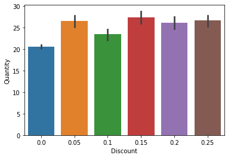


As shown in the bar graph above it is statistically significant that the customers order more of a product when it is discounted than when it is at full price. Whether it is 5%, 15%, 20%, or 25% it will increase the quantity of products sold in an order.

# Hypothesis 2

> Does discount have a statistically significant effect on the total amount spent in an order? 

- $H_0$: The customer spends the same amount of money whether it's discounted or full price. 
- $H_A$: The customer spends more or less money whether it's discounted or full price.

Explore the data and pull in the information needed to test the hypothesis. Another column was created to show the total amount spent. To find the total amount spent on an order we multiply the unit price by the number of items bought. After gathering the information a bar graph is made to have a general visual of the dataset pulled. 


```python
cur.execute('''SELECT * from OrderDetail''')
col_names = [x[0] for x in cur.description]
col_names
```


    ['Id', 'OrderId', 'ProductId', 'UnitPrice', 'Quantity', 'Discount']


```python
df = pd.DataFrame(cur.fetchall(), columns = col_names)
df.head()
```


<div>
<style scoped>
    .dataframe tbody tr th:only-of-type {
        vertical-align: middle;
    }

    .dataframe tbody tr th {
        vertical-align: top;
    }

    .dataframe thead th {
        text-align: right;
    }
</style>
<table border="1" class="dataframe">
  <thead>
    <tr style="text-align: right;">
      <th></th>
      <th>Id</th>
      <th>OrderId</th>
      <th>ProductId</th>
      <th>UnitPrice</th>
      <th>Quantity</th>
      <th>Discount</th>
    </tr>
  </thead>
  <tbody>
    <tr>
      <th>0</th>
      <td>10248/11</td>
      <td>10248</td>
      <td>11</td>
      <td>14.0</td>
      <td>12</td>
      <td>0.0</td>
    </tr>
    <tr>
      <th>1</th>
      <td>10248/42</td>
      <td>10248</td>
      <td>42</td>
      <td>9.8</td>
      <td>10</td>
      <td>0.0</td>
    </tr>
    <tr>
      <th>2</th>
      <td>10248/72</td>
      <td>10248</td>
      <td>72</td>
      <td>34.8</td>
      <td>5</td>
      <td>0.0</td>
    </tr>
    <tr>
      <th>3</th>
      <td>10249/14</td>
      <td>10249</td>
      <td>14</td>
      <td>18.6</td>
      <td>9</td>
      <td>0.0</td>
    </tr>
    <tr>
      <th>4</th>
      <td>10249/51</td>
      <td>10249</td>
      <td>51</td>
      <td>42.4</td>
      <td>40</td>
      <td>0.0</td>
    </tr>
  </tbody>
</table>
</div>


```python
df['Total Spent'] = df['UnitPrice'] * df['Quantity']
df
```


<div>
<style scoped>
    .dataframe tbody tr th:only-of-type {
        vertical-align: middle;
    }

    .dataframe tbody tr th {
        vertical-align: top;
    }

    .dataframe thead th {
        text-align: right;
    }
</style>
<table border="1" class="dataframe">
  <thead>
    <tr style="text-align: right;">
      <th></th>
      <th>Id</th>
      <th>OrderId</th>
      <th>ProductId</th>
      <th>UnitPrice</th>
      <th>Quantity</th>
      <th>Discount</th>
      <th>Total Spent</th>
    </tr>
  </thead>
  <tbody>
    <tr>
      <th>0</th>
      <td>10248/11</td>
      <td>10248</td>
      <td>11</td>
      <td>14.00</td>
      <td>12</td>
      <td>0.00</td>
      <td>168.00</td>
    </tr>
    <tr>
      <th>1</th>
      <td>10248/42</td>
      <td>10248</td>
      <td>42</td>
      <td>9.80</td>
      <td>10</td>
      <td>0.00</td>
      <td>98.00</td>
    </tr>
    <tr>
      <th>2</th>
      <td>10248/72</td>
      <td>10248</td>
      <td>72</td>
      <td>34.80</td>
      <td>5</td>
      <td>0.00</td>
      <td>174.00</td>
    </tr>
    <tr>
      <th>3</th>
      <td>10249/14</td>
      <td>10249</td>
      <td>14</td>
      <td>18.60</td>
      <td>9</td>
      <td>0.00</td>
      <td>167.40</td>
    </tr>
    <tr>
      <th>4</th>
      <td>10249/51</td>
      <td>10249</td>
      <td>51</td>
      <td>42.40</td>
      <td>40</td>
      <td>0.00</td>
      <td>1696.00</td>
    </tr>
    <tr>
      <th>5</th>
      <td>10250/41</td>
      <td>10250</td>
      <td>41</td>
      <td>7.70</td>
      <td>10</td>
      <td>0.00</td>
      <td>77.00</td>
    </tr>
    <tr>
      <th>6</th>
      <td>10250/51</td>
      <td>10250</td>
      <td>51</td>
      <td>42.40</td>
      <td>35</td>
      <td>0.15</td>
      <td>1484.00</td>
    </tr>
    <tr>
      <th>7</th>
      <td>10250/65</td>
      <td>10250</td>
      <td>65</td>
      <td>16.80</td>
      <td>15</td>
      <td>0.15</td>
      <td>252.00</td>
    </tr>
    <tr>
      <th>8</th>
      <td>10251/22</td>
      <td>10251</td>
      <td>22</td>
      <td>16.80</td>
      <td>6</td>
      <td>0.05</td>
      <td>100.80</td>
    </tr>
    <tr>
      <th>9</th>
      <td>10251/57</td>
      <td>10251</td>
      <td>57</td>
      <td>15.60</td>
      <td>15</td>
      <td>0.05</td>
      <td>234.00</td>
    </tr>
    <tr>
      <th>10</th>
      <td>10251/65</td>
      <td>10251</td>
      <td>65</td>
      <td>16.80</td>
      <td>20</td>
      <td>0.00</td>
      <td>336.00</td>
    </tr>
    <tr>
      <th>11</th>
      <td>10252/20</td>
      <td>10252</td>
      <td>20</td>
      <td>64.80</td>
      <td>40</td>
      <td>0.05</td>
      <td>2592.00</td>
    </tr>
    <tr>
      <th>12</th>
      <td>10252/33</td>
      <td>10252</td>
      <td>33</td>
      <td>2.00</td>
      <td>25</td>
      <td>0.05</td>
      <td>50.00</td>
    </tr>
    <tr>
      <th>13</th>
      <td>10252/60</td>
      <td>10252</td>
      <td>60</td>
      <td>27.20</td>
      <td>40</td>
      <td>0.00</td>
      <td>1088.00</td>
    </tr>
    <tr>
      <th>14</th>
      <td>10253/31</td>
      <td>10253</td>
      <td>31</td>
      <td>10.00</td>
      <td>20</td>
      <td>0.00</td>
      <td>200.00</td>
    </tr>
    <tr>
      <th>15</th>
      <td>10253/39</td>
      <td>10253</td>
      <td>39</td>
      <td>14.40</td>
      <td>42</td>
      <td>0.00</td>
      <td>604.80</td>
    </tr>
    <tr>
      <th>16</th>
      <td>10253/49</td>
      <td>10253</td>
      <td>49</td>
      <td>16.00</td>
      <td>40</td>
      <td>0.00</td>
      <td>640.00</td>
    </tr>
    <tr>
      <th>17</th>
      <td>10254/24</td>
      <td>10254</td>
      <td>24</td>
      <td>3.60</td>
      <td>15</td>
      <td>0.15</td>
      <td>54.00</td>
    </tr>
    <tr>
      <th>18</th>
      <td>10254/55</td>
      <td>10254</td>
      <td>55</td>
      <td>19.20</td>
      <td>21</td>
      <td>0.15</td>
      <td>403.20</td>
    </tr>
    <tr>
      <th>19</th>
      <td>10254/74</td>
      <td>10254</td>
      <td>74</td>
      <td>8.00</td>
      <td>21</td>
      <td>0.00</td>
      <td>168.00</td>
    </tr>
    <tr>
      <th>20</th>
      <td>10255/2</td>
      <td>10255</td>
      <td>2</td>
      <td>15.20</td>
      <td>20</td>
      <td>0.00</td>
      <td>304.00</td>
    </tr>
    <tr>
      <th>21</th>
      <td>10255/16</td>
      <td>10255</td>
      <td>16</td>
      <td>13.90</td>
      <td>35</td>
      <td>0.00</td>
      <td>486.50</td>
    </tr>
    <tr>
      <th>22</th>
      <td>10255/36</td>
      <td>10255</td>
      <td>36</td>
      <td>15.20</td>
      <td>25</td>
      <td>0.00</td>
      <td>380.00</td>
    </tr>
    <tr>
      <th>23</th>
      <td>10255/59</td>
      <td>10255</td>
      <td>59</td>
      <td>44.00</td>
      <td>30</td>
      <td>0.00</td>
      <td>1320.00</td>
    </tr>
    <tr>
      <th>24</th>
      <td>10256/53</td>
      <td>10256</td>
      <td>53</td>
      <td>26.20</td>
      <td>15</td>
      <td>0.00</td>
      <td>393.00</td>
    </tr>
    <tr>
      <th>25</th>
      <td>10256/77</td>
      <td>10256</td>
      <td>77</td>
      <td>10.40</td>
      <td>12</td>
      <td>0.00</td>
      <td>124.80</td>
    </tr>
    <tr>
      <th>26</th>
      <td>10257/27</td>
      <td>10257</td>
      <td>27</td>
      <td>35.10</td>
      <td>25</td>
      <td>0.00</td>
      <td>877.50</td>
    </tr>
    <tr>
      <th>27</th>
      <td>10257/39</td>
      <td>10257</td>
      <td>39</td>
      <td>14.40</td>
      <td>6</td>
      <td>0.00</td>
      <td>86.40</td>
    </tr>
    <tr>
      <th>28</th>
      <td>10257/77</td>
      <td>10257</td>
      <td>77</td>
      <td>10.40</td>
      <td>15</td>
      <td>0.00</td>
      <td>156.00</td>
    </tr>
    <tr>
      <th>29</th>
      <td>10258/2</td>
      <td>10258</td>
      <td>2</td>
      <td>15.20</td>
      <td>50</td>
      <td>0.20</td>
      <td>760.00</td>
    </tr>
    <tr>
      <th>...</th>
      <td>...</td>
      <td>...</td>
      <td>...</td>
      <td>...</td>
      <td>...</td>
      <td>...</td>
      <td>...</td>
    </tr>
    <tr>
      <th>2125</th>
      <td>11075/46</td>
      <td>11075</td>
      <td>46</td>
      <td>12.00</td>
      <td>30</td>
      <td>0.15</td>
      <td>360.00</td>
    </tr>
    <tr>
      <th>2126</th>
      <td>11075/76</td>
      <td>11075</td>
      <td>76</td>
      <td>18.00</td>
      <td>2</td>
      <td>0.15</td>
      <td>36.00</td>
    </tr>
    <tr>
      <th>2127</th>
      <td>11076/6</td>
      <td>11076</td>
      <td>6</td>
      <td>25.00</td>
      <td>20</td>
      <td>0.25</td>
      <td>500.00</td>
    </tr>
    <tr>
      <th>2128</th>
      <td>11076/14</td>
      <td>11076</td>
      <td>14</td>
      <td>23.25</td>
      <td>20</td>
      <td>0.25</td>
      <td>465.00</td>
    </tr>
    <tr>
      <th>2129</th>
      <td>11076/19</td>
      <td>11076</td>
      <td>19</td>
      <td>9.20</td>
      <td>10</td>
      <td>0.25</td>
      <td>92.00</td>
    </tr>
    <tr>
      <th>2130</th>
      <td>11077/2</td>
      <td>11077</td>
      <td>2</td>
      <td>19.00</td>
      <td>24</td>
      <td>0.20</td>
      <td>456.00</td>
    </tr>
    <tr>
      <th>2131</th>
      <td>11077/3</td>
      <td>11077</td>
      <td>3</td>
      <td>10.00</td>
      <td>4</td>
      <td>0.00</td>
      <td>40.00</td>
    </tr>
    <tr>
      <th>2132</th>
      <td>11077/4</td>
      <td>11077</td>
      <td>4</td>
      <td>22.00</td>
      <td>1</td>
      <td>0.00</td>
      <td>22.00</td>
    </tr>
    <tr>
      <th>2133</th>
      <td>11077/6</td>
      <td>11077</td>
      <td>6</td>
      <td>25.00</td>
      <td>1</td>
      <td>0.02</td>
      <td>25.00</td>
    </tr>
    <tr>
      <th>2134</th>
      <td>11077/7</td>
      <td>11077</td>
      <td>7</td>
      <td>30.00</td>
      <td>1</td>
      <td>0.05</td>
      <td>30.00</td>
    </tr>
    <tr>
      <th>2135</th>
      <td>11077/8</td>
      <td>11077</td>
      <td>8</td>
      <td>40.00</td>
      <td>2</td>
      <td>0.10</td>
      <td>80.00</td>
    </tr>
    <tr>
      <th>2136</th>
      <td>11077/10</td>
      <td>11077</td>
      <td>10</td>
      <td>31.00</td>
      <td>1</td>
      <td>0.00</td>
      <td>31.00</td>
    </tr>
    <tr>
      <th>2137</th>
      <td>11077/12</td>
      <td>11077</td>
      <td>12</td>
      <td>38.00</td>
      <td>2</td>
      <td>0.05</td>
      <td>76.00</td>
    </tr>
    <tr>
      <th>2138</th>
      <td>11077/13</td>
      <td>11077</td>
      <td>13</td>
      <td>6.00</td>
      <td>4</td>
      <td>0.00</td>
      <td>24.00</td>
    </tr>
    <tr>
      <th>2139</th>
      <td>11077/14</td>
      <td>11077</td>
      <td>14</td>
      <td>23.25</td>
      <td>1</td>
      <td>0.03</td>
      <td>23.25</td>
    </tr>
    <tr>
      <th>2140</th>
      <td>11077/16</td>
      <td>11077</td>
      <td>16</td>
      <td>17.45</td>
      <td>2</td>
      <td>0.03</td>
      <td>34.90</td>
    </tr>
    <tr>
      <th>2141</th>
      <td>11077/20</td>
      <td>11077</td>
      <td>20</td>
      <td>81.00</td>
      <td>1</td>
      <td>0.04</td>
      <td>81.00</td>
    </tr>
    <tr>
      <th>2142</th>
      <td>11077/23</td>
      <td>11077</td>
      <td>23</td>
      <td>9.00</td>
      <td>2</td>
      <td>0.00</td>
      <td>18.00</td>
    </tr>
    <tr>
      <th>2143</th>
      <td>11077/32</td>
      <td>11077</td>
      <td>32</td>
      <td>32.00</td>
      <td>1</td>
      <td>0.00</td>
      <td>32.00</td>
    </tr>
    <tr>
      <th>2144</th>
      <td>11077/39</td>
      <td>11077</td>
      <td>39</td>
      <td>18.00</td>
      <td>2</td>
      <td>0.05</td>
      <td>36.00</td>
    </tr>
    <tr>
      <th>2145</th>
      <td>11077/41</td>
      <td>11077</td>
      <td>41</td>
      <td>9.65</td>
      <td>3</td>
      <td>0.00</td>
      <td>28.95</td>
    </tr>
    <tr>
      <th>2146</th>
      <td>11077/46</td>
      <td>11077</td>
      <td>46</td>
      <td>12.00</td>
      <td>3</td>
      <td>0.02</td>
      <td>36.00</td>
    </tr>
    <tr>
      <th>2147</th>
      <td>11077/52</td>
      <td>11077</td>
      <td>52</td>
      <td>7.00</td>
      <td>2</td>
      <td>0.00</td>
      <td>14.00</td>
    </tr>
    <tr>
      <th>2148</th>
      <td>11077/55</td>
      <td>11077</td>
      <td>55</td>
      <td>24.00</td>
      <td>2</td>
      <td>0.00</td>
      <td>48.00</td>
    </tr>
    <tr>
      <th>2149</th>
      <td>11077/60</td>
      <td>11077</td>
      <td>60</td>
      <td>34.00</td>
      <td>2</td>
      <td>0.06</td>
      <td>68.00</td>
    </tr>
    <tr>
      <th>2150</th>
      <td>11077/64</td>
      <td>11077</td>
      <td>64</td>
      <td>33.25</td>
      <td>2</td>
      <td>0.03</td>
      <td>66.50</td>
    </tr>
    <tr>
      <th>2151</th>
      <td>11077/66</td>
      <td>11077</td>
      <td>66</td>
      <td>17.00</td>
      <td>1</td>
      <td>0.00</td>
      <td>17.00</td>
    </tr>
    <tr>
      <th>2152</th>
      <td>11077/73</td>
      <td>11077</td>
      <td>73</td>
      <td>15.00</td>
      <td>2</td>
      <td>0.01</td>
      <td>30.00</td>
    </tr>
    <tr>
      <th>2153</th>
      <td>11077/75</td>
      <td>11077</td>
      <td>75</td>
      <td>7.75</td>
      <td>4</td>
      <td>0.00</td>
      <td>31.00</td>
    </tr>
    <tr>
      <th>2154</th>
      <td>11077/77</td>
      <td>11077</td>
      <td>77</td>
      <td>13.00</td>
      <td>2</td>
      <td>0.00</td>
      <td>26.00</td>
    </tr>
  </tbody>
</table>
<p>2155 rows × 7 columns</p>
</div>


```python
sns.barplot(data=df, x = df['Discount'], y= df['Total Spent'], ci=68);
```


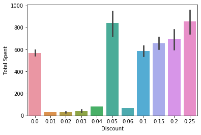


Then a discount dictionary is created to group all the discount categories with the total spent to create a subplot showing the distribution. (Shown below)


```python
discounts = {}
for discount_grps in df['Discount'].unique():
    discounts[discount_grps]= df.groupby('Discount').get_group(discount_grps)['Total Spent']
discounts
```


    {0.0: 0        168.00
     1         98.00
     2        174.00
     3        167.40
     4       1696.00
     5         77.00
     10       336.00
     13      1088.00
     14       200.00
     15       604.80
     16       640.00
     19       168.00
     20       304.00
     21       486.50
     22       380.00
     23      1320.00
     24       393.00
     25       124.80
     26       877.50
     27        86.40
     28       156.00
     32        80.00
     33        20.80
     35       780.00
     38       160.00
     39       288.00
     41       360.00
     42        60.80
     44       100.80
     47       532.00
              ...   
     2088     136.00
     2089     130.00
     2090     510.00
     2093     420.00
     2097     115.80
     2100     687.50
     2103      52.35
     2104     386.40
     2105     490.00
     2106      86.85
     2110     360.00
     2114     250.00
     2117     152.00
     2118     386.00
     2119     357.50
     2120    4322.50
     2121     210.00
     2122      90.00
     2131      40.00
     2132      22.00
     2136      31.00
     2138      24.00
     2142      18.00
     2143      32.00
     2145      28.95
     2147      14.00
     2148      48.00
     2151      17.00
     2153      31.00
     2154      26.00
     Name: Total Spent, Length: 1317, dtype: float64, 0.15: 6       1484.0
     7        252.0
     17        54.0
     18       403.2
     48       192.5
     53      3080.0
     54       216.0
     104      556.0
     106      144.0
     196      291.9
     197     1008.0
     199     1760.0
     200     2808.0
     220     1245.0
     221      695.0
     250      396.0
     266      720.0
     268       37.2
     269      216.0
     279      118.0
     326      216.0
     328      160.0
     341      728.0
     342      288.0
     397       80.0
     398      763.2
     414      291.9
     415      714.0
     463       29.2
     465      393.0
              ...  
     1757      84.0
     1774     252.0
     1793     190.0
     1794     560.0
     1829     488.6
     1830     312.5
     1832     816.0
     1843     155.0
     1853      68.0
     1859     456.0
     1860     591.6
     1882     800.0
     1883     400.0
     1885     116.7
     1896     504.0
     1917     840.0
     1918    1560.0
     1919    1881.0
     1948     270.0
     1949     336.0
     1993     744.0
     2107     364.8
     2108    1656.0
     2109     364.0
     2111     720.0
     2112     380.0
     2113     523.5
     2124     190.0
     2125     360.0
     2126      36.0
     Name: Total Spent, Length: 157, dtype: float64, 0.05: 8        100.8
     9        234.0
     11      2592.0
     12        50.0
     51       364.8
     57       120.0
     58       556.0
     65       595.2
     66       150.0
     68       882.0
     69       475.2
     72        43.2
     73       264.0
     216       73.0
     217      165.6
     218     4216.0
     219      364.8
     244     2184.0
     246     1000.0
     247       92.4
     248     1472.0
     256       40.0
     274     4216.0
     276     1193.5
     277      168.0
     292       36.0
     293      112.0
     294      304.0
     295      778.4
     296      700.0
              ...  
     1691     930.0
     1712     360.0
     1715     600.0
     1716      98.0
     1822      37.5
     1823      57.9
     1824     387.5
     1825     400.0
     1827    4050.0
     1828     625.0
     1846      42.0
     1926     990.0
     1937     193.0
     1938     795.0
     1939     273.0
     1963    3192.0
     1964    1260.0
     1971     530.0
     1973     460.0
     1974    1224.0
     1975    1290.0
     2057     760.0
     2058     480.0
     2059     324.0
     2115     450.0
     2116      60.0
     2123     244.3
     2134      30.0
     2137      76.0
     2144      36.0
     Name: Total Spent, Length: 185, dtype: float64, 0.2: 29        760.00
     30       1105.00
     31        153.60
     40        204.00
     99        648.00
     100       588.00
     101       943.20
     209       380.00
     210       840.00
     211       724.50
     212       318.00
     223      2000.00
     224       112.00
     225       121.60
     231       106.40
     232       250.00
     233       153.60
     234      2035.20
     251       364.80
     252       560.00
     253       608.00
     254       768.00
     280       201.60
     281     10540.00
     289       744.00
     291       217.60
     329        91.20
     334       848.00
     335       860.00
     362       240.00
               ...   
     1572      342.00
     1573     1530.00
     1574     1182.50
     1656      270.00
     1657      855.00
     1658      750.00
     1750      140.00
     1751      460.00
     1752      336.00
     1772      600.00
     1773      397.50
     1786      570.00
     1833       93.00
     1867      280.00
     1892      310.00
     1920      950.00
     1921      300.00
     1922     1620.00
     2041       92.00
     2049      570.00
     2063      190.00
     2064      152.00
     2066       45.00
     2067     1380.00
     2068      285.00
     2069     2187.50
     2071      831.25
     2091      328.00
     2092      180.00
     2130      456.00
     Name: Total Spent, Length: 161, dtype: float64, 0.25: 34       123.20
     36       591.00
     37       252.00
     43       834.00
     45      1242.00
     46       288.00
     82       468.00
     95       526.50
     97       544.00
     98        56.00
     135      608.00
     136     1320.00
     259     2240.00
     325      547.20
     330      777.60
     331     8432.00
     332     1904.00
     333     1167.60
     384      380.00
     385      781.20
     386       78.40
     387     1743.00
     450       19.20
     451      360.00
     473      192.00
     474      288.00
     480     1228.50
     485     1560.00
     486      735.00
     487      228.00
              ...   
     1791    1666.00
     1792     752.50
     1797     550.00
     1798    1479.00
     1799    1000.00
     1805     105.00
     1806     350.10
     1844      45.00
     1924    6189.50
     1925     337.75
     1931     240.00
     1932     140.00
     1940     550.00
     1941     135.00
     1959     247.58
     1967     342.00
     1994     209.00
     1997    2332.00
     2011     135.00
     2012    1035.30
     2017    1900.00
     2019    7427.40
     2020    5500.00
     2060     450.00
     2061     640.50
     2101     103.56
     2102     149.00
     2127     500.00
     2128     465.00
     2129      92.00
     Name: Total Spent, Length: 154, dtype: float64, 0.1: 107       59.0
     108       30.0
     115       96.0
     116      372.0
     117       84.8
     147      588.0
     148      504.0
     149      150.0
     153     1250.0
     154     2475.0
     155      432.0
     177     1024.0
     178      318.0
     179      985.0
     227       80.0
     228      688.0
     235      316.8
     263     1123.2
     272      195.0
     273      518.4
     303      777.6
     304     1496.0
     320       40.0
     321      473.2
     323      931.0
     344       61.6
     345      561.6
     346      336.0
     347      372.6
     348      524.0
              ...  
     1547     397.5
     1548     522.0
     1561     630.0
     1562     450.0
     1563     588.0
     1564     795.0
     1628     840.0
     1646     199.5
     1753     620.0
     1754    1368.0
     1776     523.5
     1777     690.2
     1779     155.0
     1901     628.2
     1902     500.0
     1903    1120.0
     1912    1972.0
     1980     270.2
     2007     180.0
     2008     120.0
     2029    2296.0
     2030    1296.0
     2031     150.0
     2065     900.0
     2094     736.0
     2095     289.5
     2096    3003.0
     2098     820.0
     2099      96.0
     2135      80.0
     Name: Total Spent, Length: 173, dtype: float64, 0.02: 2133    25.0
     2146    36.0
     Name: Total Spent, dtype: float64, 0.03: 2139    23.25
     2140    34.90
     2150    66.50
     Name: Total Spent, dtype: float64, 0.04: 2141    81.0
     Name: Total Spent, dtype: float64, 0.06: 2149    68.0
     Name: Total Spent, dtype: float64, 0.01: 2152    30.0
     Name: Total Spent, dtype: float64}


```python
fig, ax=plt.subplots(figsize = (8,5))
for discount_grps, grp_data in discounts.items():
    sns.distplot(grp_data, label=discount_grps, ax=ax )
ax.legend()
ax.set(title ='Total Spent by Discounted Group', ylabel = 'Density');
```


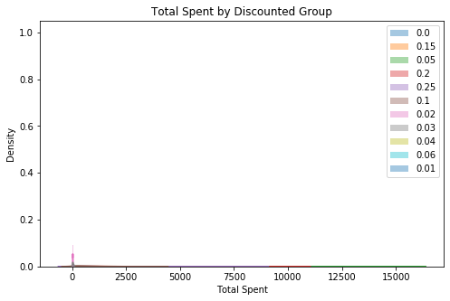


The idx_outs function is used to find and delete outliers using z-scores. Another subplot graph is then created to see the difference once the outliers found are gone. We can see a slightly more normal distribution in the graph below.


```python
for discount_grps, grp_data in discounts.items():
    idx_outs = find_outliers_z(grp_data)
    print(f'I found {idx_outs.sum()} outliers in {discount_grps} using z-scores')
    discounts[discount_grps] = grp_data[-idx_outs]
```

    I found 19 outliers in 0.0 using z-scores
    I found 5 outliers in 0.15 using z-scores
    I found 3 outliers in 0.05 using z-scores
    I found 2 outliers in 0.2 using z-scores
    I found 6 outliers in 0.25 using z-scores
    I found 3 outliers in 0.1 using z-scores
    I found 0 outliers in 0.02 using z-scores
    I found 0 outliers in 0.03 using z-scores
    I found 0 outliers in 0.04 using z-scores
    I found 0 outliers in 0.06 using z-scores
    I found 0 outliers in 0.01 using z-scores


```python
fig, ax=plt.subplots(figsize = (8,5))
for discount_grps, grp_data in discounts.items():
    sns.distplot(grp_data, label=discount_grps, ax=ax )
ax.legend()
ax.set(title ='Total Spent by Discounted Group', ylabel = 'Density');
```


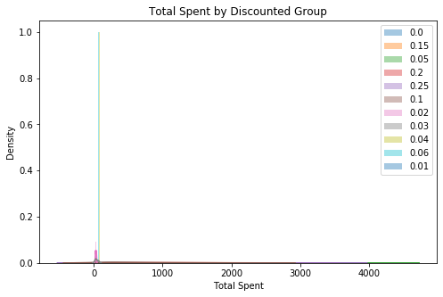


The discount percentages that do not have enough data are then taken out of the dataset using a for loop to find the small categories. The other discount categories with more than 8 data points are then shown with a p-value < 0.05 Therefore the data is not normal but because the size of the data. The results of the normal test is ignored. Therefore, moving on to test the equal variance using the levene's test. The results are shown below.


```python
for k,v in discounts.items():
    if len(v) > 8: 
        stat,p = stats.normaltest(v)
        print(f"The {k} Normaltest p-value = {round(p,4)}")
    else: 
        print(f"The column {k} is too small.")
```

    The 0.0 Normaltest p-value = 0.0
    The 0.15 Normaltest p-value = 0.0
    The 0.05 Normaltest p-value = 0.0
    The 0.2 Normaltest p-value = 0.0
    The 0.25 Normaltest p-value = 0.0
    The 0.1 Normaltest p-value = 0.0
    The column 0.02 is too small.
    The column 0.03 is too small.
    The column 0.04 is too small.
    The column 0.06 is too small.
    The column 0.01 is too small.


```python
toosmall = (0.02, 0.03, 0.04, 0.06, 0.01)
for key in toosmall:
    discounts.pop(key)
```


```python
for k,v in discounts.items():
    print(f"There are {len(v)} in group {k}")
```

    There are 1298 in group 0.0
    There are 152 in group 0.15
    There are 182 in group 0.05
    There are 159 in group 0.2
    There are 148 in group 0.25
    There are 170 in group 0.1


```python
data = []
for k,v in discounts.items():
    data.append(v)
data[0]
```


    0        168.00
    1         98.00
    2        174.00
    3        167.40
    4       1696.00
    5         77.00
    10       336.00
    13      1088.00
    14       200.00
    15       604.80
    16       640.00
    19       168.00
    20       304.00
    21       486.50
    22       380.00
    23      1320.00
    24       393.00
    25       124.80
    26       877.50
    27        86.40
    28       156.00
    32        80.00
    33        20.80
    35       780.00
    38       160.00
    39       288.00
    41       360.00
    42        60.80
    44       100.80
    47       532.00
             ...   
    2087    1190.00
    2088     136.00
    2089     130.00
    2090     510.00
    2093     420.00
    2097     115.80
    2100     687.50
    2103      52.35
    2104     386.40
    2105     490.00
    2106      86.85
    2110     360.00
    2114     250.00
    2117     152.00
    2118     386.00
    2119     357.50
    2121     210.00
    2122      90.00
    2131      40.00
    2132      22.00
    2136      31.00
    2138      24.00
    2142      18.00
    2143      32.00
    2145      28.95
    2147      14.00
    2148      48.00
    2151      17.00
    2153      31.00
    2154      26.00
    Name: Total Spent, Length: 1298, dtype: float64


```python
stat,p = stats.levene(*data) 
print(f'Levenes test for equal variance p-value ={round(p,4)} therefore it does not have equal variance.')
```

    Levenes test for equal variance p-value =0.0025 therefore it does not have equal variance.


```python
stat,p = stats.kruskal(*data)
print(f'Kruskal-Wallis t-test p-value ={round(p,4)} therefore the alternative hypothesis is statistically significance.')
```

    Kruskal-Wallis t-test p-value =0.0 therefore the alternative hypothesis is statistically significance.


With multiple different discount percentages a tukey's test is done to see which groups are significantly different between the amount of items sold correlated with at which the discount was given. A matrix table was then created comparing each group with another showing the mean difference.


```python
df_tukeys = prep_data_for_tukeys(discounts)
df_tukeys.head()
df_tukeys.columns = ['Total Spent','Discount']
```


```python
from statsmodels.stats.multicomp import pairwise_tukeyhsd
model= pairwise_tukeyhsd(df_tukeys['Total Spent'],df_tukeys['Discount'])
model.summary()
df = pd.DataFrame(data=model._results_table.data[1:], columns=model._results_table.data[0])
df
```


<div>
<style scoped>
    .dataframe tbody tr th:only-of-type {
        vertical-align: middle;
    }

    .dataframe tbody tr th {
        vertical-align: top;
    }

    .dataframe thead th {
        text-align: right;
    }
</style>
<table border="1" class="dataframe">
  <thead>
    <tr style="text-align: right;">
      <th></th>
      <th>group1</th>
      <th>group2</th>
      <th>meandiff</th>
      <th>p-adj</th>
      <th>lower</th>
      <th>upper</th>
      <th>reject</th>
    </tr>
  </thead>
  <tbody>
    <tr>
      <th>0</th>
      <td>0.0</td>
      <td>0.05</td>
      <td>205.7636</td>
      <td>0.0010</td>
      <td>81.0109</td>
      <td>330.5163</td>
      <td>True</td>
    </tr>
    <tr>
      <th>1</th>
      <td>0.0</td>
      <td>0.1</td>
      <td>58.2625</td>
      <td>0.7623</td>
      <td>-70.2938</td>
      <td>186.8188</td>
      <td>False</td>
    </tr>
    <tr>
      <th>2</th>
      <td>0.0</td>
      <td>0.15</td>
      <td>90.6617</td>
      <td>0.3954</td>
      <td>-44.4575</td>
      <td>225.7809</td>
      <td>False</td>
    </tr>
    <tr>
      <th>3</th>
      <td>0.0</td>
      <td>0.2</td>
      <td>87.0942</td>
      <td>0.4193</td>
      <td>-45.3357</td>
      <td>219.5241</td>
      <td>False</td>
    </tr>
    <tr>
      <th>4</th>
      <td>0.0</td>
      <td>0.25</td>
      <td>139.4796</td>
      <td>0.0425</td>
      <td>2.7356</td>
      <td>276.2235</td>
      <td>True</td>
    </tr>
    <tr>
      <th>5</th>
      <td>0.05</td>
      <td>0.1</td>
      <td>-147.5011</td>
      <td>0.1240</td>
      <td>-315.6149</td>
      <td>20.6127</td>
      <td>False</td>
    </tr>
    <tr>
      <th>6</th>
      <td>0.05</td>
      <td>0.15</td>
      <td>-115.1019</td>
      <td>0.4068</td>
      <td>-288.2860</td>
      <td>58.0821</td>
      <td>False</td>
    </tr>
    <tr>
      <th>7</th>
      <td>0.05</td>
      <td>0.2</td>
      <td>-118.6694</td>
      <td>0.3557</td>
      <td>-289.7636</td>
      <td>52.4247</td>
      <td>False</td>
    </tr>
    <tr>
      <th>8</th>
      <td>0.05</td>
      <td>0.25</td>
      <td>-66.2841</td>
      <td>0.8829</td>
      <td>-240.7387</td>
      <td>108.1706</td>
      <td>False</td>
    </tr>
    <tr>
      <th>9</th>
      <td>0.1</td>
      <td>0.15</td>
      <td>32.3992</td>
      <td>0.9000</td>
      <td>-143.5446</td>
      <td>208.3430</td>
      <td>False</td>
    </tr>
    <tr>
      <th>10</th>
      <td>0.1</td>
      <td>0.2</td>
      <td>28.8317</td>
      <td>0.9000</td>
      <td>-145.0553</td>
      <td>202.7187</td>
      <td>False</td>
    </tr>
    <tr>
      <th>11</th>
      <td>0.1</td>
      <td>0.25</td>
      <td>81.2171</td>
      <td>0.7539</td>
      <td>-95.9775</td>
      <td>258.4117</td>
      <td>False</td>
    </tr>
    <tr>
      <th>12</th>
      <td>0.15</td>
      <td>0.2</td>
      <td>-3.5675</td>
      <td>0.9000</td>
      <td>-182.3611</td>
      <td>175.2262</td>
      <td>False</td>
    </tr>
    <tr>
      <th>13</th>
      <td>0.15</td>
      <td>0.25</td>
      <td>48.8179</td>
      <td>0.9000</td>
      <td>-133.1942</td>
      <td>230.8300</td>
      <td>False</td>
    </tr>
    <tr>
      <th>14</th>
      <td>0.2</td>
      <td>0.25</td>
      <td>52.3853</td>
      <td>0.9000</td>
      <td>-127.6393</td>
      <td>232.4100</td>
      <td>False</td>
    </tr>
  </tbody>
</table>
</div>


The only statistically significant discounts are gathered and shown below.


```python
sig = df.loc[df['reject']==True][['group1', 'group2', 'p-adj']]
sig.columns = ['discount1','discount2','p-value']
sig
```


<div>
<style scoped>
    .dataframe tbody tr th:only-of-type {
        vertical-align: middle;
    }

    .dataframe tbody tr th {
        vertical-align: top;
    }

    .dataframe thead th {
        text-align: right;
    }
</style>
<table border="1" class="dataframe">
  <thead>
    <tr style="text-align: right;">
      <th></th>
      <th>discount1</th>
      <th>discount2</th>
      <th>p-value</th>
    </tr>
  </thead>
  <tbody>
    <tr>
      <th>0</th>
      <td>0.0</td>
      <td>0.05</td>
      <td>0.0010</td>
    </tr>
    <tr>
      <th>4</th>
      <td>0.0</td>
      <td>0.25</td>
      <td>0.0425</td>
    </tr>
  </tbody>
</table>
</div>


```python
sns.barplot(data=df, x = df_tukeys['Discount'], y= df_tukeys['Total Spent'], ci=68);
```


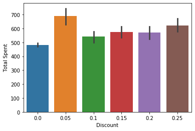


As shown in the bar graph and tukeys test above it is statistically significant that the customers spend more money in an order when it is discounted at 5% or 25%. 

# Hypothesis 3

> Does the supplier region have a statistically significant effect on the product quantity sold.

- $H_0$: The supplier region does not have an effect on the product quantity sold.
- $H_A$: THe supplier region does have an effect on the product quantity sold.

Explore the data and pull in the information needed to test the hypothesis. Two data frames were created in order to join the Order table with the OrderDetail table. After gathering the information a bar graph is created to have a general visual of the dataset pulled. 


```python
cur.execute('''SELECT *
               FROM "Order";''')
col_names = [x[0] for x in cur.description]
col_names
```


    ['Id',
     'CustomerId',
     'EmployeeId',
     'OrderDate',
     'RequiredDate',
     'ShippedDate',
     'ShipVia',
     'Freight',
     'ShipName',
     'ShipAddress',
     'ShipCity',
     'ShipRegion',
     'ShipPostalCode',
     'ShipCountry']


```python
df_order = pd.DataFrame(cur.fetchall(), columns = col_names)
```


```python
cur.execute('''SELECT *
               FROM OrderDetail;''')
col_names = [x[0] for x in cur.description]
df_details = pd.DataFrame(cur.fetchall(), columns = col_names)
df_details.head()
```


<div>
<style scoped>
    .dataframe tbody tr th:only-of-type {
        vertical-align: middle;
    }

    .dataframe tbody tr th {
        vertical-align: top;
    }

    .dataframe thead th {
        text-align: right;
    }
</style>
<table border="1" class="dataframe">
  <thead>
    <tr style="text-align: right;">
      <th></th>
      <th>Id</th>
      <th>OrderId</th>
      <th>ProductId</th>
      <th>UnitPrice</th>
      <th>Quantity</th>
      <th>Discount</th>
    </tr>
  </thead>
  <tbody>
    <tr>
      <th>0</th>
      <td>10248/11</td>
      <td>10248</td>
      <td>11</td>
      <td>14.0</td>
      <td>12</td>
      <td>0.0</td>
    </tr>
    <tr>
      <th>1</th>
      <td>10248/42</td>
      <td>10248</td>
      <td>42</td>
      <td>9.8</td>
      <td>10</td>
      <td>0.0</td>
    </tr>
    <tr>
      <th>2</th>
      <td>10248/72</td>
      <td>10248</td>
      <td>72</td>
      <td>34.8</td>
      <td>5</td>
      <td>0.0</td>
    </tr>
    <tr>
      <th>3</th>
      <td>10249/14</td>
      <td>10249</td>
      <td>14</td>
      <td>18.6</td>
      <td>9</td>
      <td>0.0</td>
    </tr>
    <tr>
      <th>4</th>
      <td>10249/51</td>
      <td>10249</td>
      <td>51</td>
      <td>42.4</td>
      <td>40</td>
      <td>0.0</td>
    </tr>
  </tbody>
</table>
</div>


```python
df = pd.merge(df_details,df_order, how='outer',left_on='OrderId', right_on='Id')
```


<div>
<style scoped>
    .dataframe tbody tr th:only-of-type {
        vertical-align: middle;
    }

    .dataframe tbody tr th {
        vertical-align: top;
    }

    .dataframe thead th {
        text-align: right;
    }
</style>
<table border="1" class="dataframe">
  <thead>
    <tr style="text-align: right;">
      <th></th>
      <th>Id_x</th>
      <th>OrderId</th>
      <th>ProductId</th>
      <th>UnitPrice</th>
      <th>Quantity</th>
      <th>Discount</th>
      <th>Id_y</th>
      <th>CustomerId</th>
      <th>EmployeeId</th>
      <th>OrderDate</th>
      <th>RequiredDate</th>
      <th>ShippedDate</th>
      <th>ShipVia</th>
      <th>Freight</th>
      <th>ShipName</th>
      <th>ShipAddress</th>
      <th>ShipCity</th>
      <th>ShipRegion</th>
      <th>ShipPostalCode</th>
      <th>ShipCountry</th>
    </tr>
  </thead>
  <tbody>
    <tr>
      <th>0</th>
      <td>10248/11</td>
      <td>10248</td>
      <td>11</td>
      <td>14.0</td>
      <td>12</td>
      <td>0.0</td>
      <td>10248</td>
      <td>VINET</td>
      <td>5</td>
      <td>2012-07-04</td>
      <td>2012-08-01</td>
      <td>2012-07-16</td>
      <td>3</td>
      <td>32.38</td>
      <td>Vins et alcools Chevalier</td>
      <td>59 rue de l'Abbaye</td>
      <td>Reims</td>
      <td>Western Europe</td>
      <td>51100</td>
      <td>France</td>
    </tr>
    <tr>
      <th>1</th>
      <td>10248/42</td>
      <td>10248</td>
      <td>42</td>
      <td>9.8</td>
      <td>10</td>
      <td>0.0</td>
      <td>10248</td>
      <td>VINET</td>
      <td>5</td>
      <td>2012-07-04</td>
      <td>2012-08-01</td>
      <td>2012-07-16</td>
      <td>3</td>
      <td>32.38</td>
      <td>Vins et alcools Chevalier</td>
      <td>59 rue de l'Abbaye</td>
      <td>Reims</td>
      <td>Western Europe</td>
      <td>51100</td>
      <td>France</td>
    </tr>
    <tr>
      <th>2</th>
      <td>10248/72</td>
      <td>10248</td>
      <td>72</td>
      <td>34.8</td>
      <td>5</td>
      <td>0.0</td>
      <td>10248</td>
      <td>VINET</td>
      <td>5</td>
      <td>2012-07-04</td>
      <td>2012-08-01</td>
      <td>2012-07-16</td>
      <td>3</td>
      <td>32.38</td>
      <td>Vins et alcools Chevalier</td>
      <td>59 rue de l'Abbaye</td>
      <td>Reims</td>
      <td>Western Europe</td>
      <td>51100</td>
      <td>France</td>
    </tr>
    <tr>
      <th>3</th>
      <td>10249/14</td>
      <td>10249</td>
      <td>14</td>
      <td>18.6</td>
      <td>9</td>
      <td>0.0</td>
      <td>10249</td>
      <td>TOMSP</td>
      <td>6</td>
      <td>2012-07-05</td>
      <td>2012-08-16</td>
      <td>2012-07-10</td>
      <td>1</td>
      <td>11.61</td>
      <td>Toms Spezialitäten</td>
      <td>Luisenstr. 48</td>
      <td>Münster</td>
      <td>Western Europe</td>
      <td>44087</td>
      <td>Germany</td>
    </tr>
    <tr>
      <th>4</th>
      <td>10249/51</td>
      <td>10249</td>
      <td>51</td>
      <td>42.4</td>
      <td>40</td>
      <td>0.0</td>
      <td>10249</td>
      <td>TOMSP</td>
      <td>6</td>
      <td>2012-07-05</td>
      <td>2012-08-16</td>
      <td>2012-07-10</td>
      <td>1</td>
      <td>11.61</td>
      <td>Toms Spezialitäten</td>
      <td>Luisenstr. 48</td>
      <td>Münster</td>
      <td>Western Europe</td>
      <td>44087</td>
      <td>Germany</td>
    </tr>
  </tbody>
</table>
</div>


```python
ax = sns.barplot(data=df, x ='ShipRegion', y='Quantity', ci=68)
ax.set_xticklabels(ax.get_xticklabels(),rotation=45, ha='right');
```


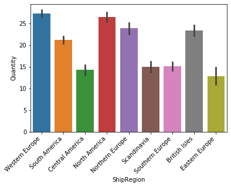


A regions dictionary is created to store all the data gathered in the two columns. The different ship regions and the quantity amount sold in the order. Then the dictionary is used to create a subplot to view the distribution of the data population.


```python
regions = {}
for region_grps in df['ShipRegion'].unique():
    regions[region_grps]= df.groupby('ShipRegion').get_group(region_grps)['Quantity']
regions
```


    {'Western Europe': 0        12
     1        10
     2         5
     3         9
     4        40
     8         6
     9        15
     10       20
     11       40
     12       25
     13       40
     17       15
     18       21
     19       21
     20       20
     21       35
     22       25
     23       30
     29       50
     30       65
     31        6
     34       16
     35       50
     36       15
     37       21
     43       60
     44       28
     45       60
     46       36
     49       30
            ... 
     2042      2
     2043     30
     2049     30
     2050     30
     2053     10
     2057     20
     2058     15
     2059     18
     2066     10
     2069     35
     2070     20
     2071     25
     2082      3
     2083     21
     2084      4
     2106      9
     2111     40
     2112     20
     2113     30
     2114     20
     2117      8
     2118     40
     2119     22
     2120    130
     2124     10
     2125     30
     2126      2
     2127     20
     2128     20
     2129     10
     Name: Quantity, Length: 745, dtype: int64, 'South America': 5       10
     6       35
     7       15
     14      20
     15      42
     16      40
     24      15
     25      12
     26      25
     27       6
     28      15
     38      20
     39      20
     55      10
     56       4
     91      20
     92      18
     93      35
     94       3
     104     40
     105     20
     106     15
     111     20
     112     15
     113     15
     114     10
     115     20
     116     24
     117      2
     118     20
             ..
     1991     3
     1992     2
     1999    35
     2000    30
     2044    20
     2045    24
     2046    60
     2047    28
     2051    15
     2052     4
     2063    10
     2064     4
     2067    30
     2068    10
     2072    10
     2073    20
     2074    15
     2075    15
     2076    20
     2077    20
     2085    30
     2086    12
     2087    35
     2101     4
     2102    20
     2107     8
     2108    36
     2109    28
     2115    15
     2116    10
     Name: Quantity, Length: 355, dtype: int64, 'Central America': 32      10
     33       1
     74      15
     75      10
     119     12
     120     10
     121      5
     122      6
     150     30
     151     10
     152      2
     161      1
     162      5
     187      8
     188     14
     189     30
     192     20
     282     12
     283      4
     313     24
     600     12
     601     18
     602     21
     603     10
     667     21
     668      6
     669     30
     679     15
     680     15
     712      5
             ..
     997      3
     998      5
     999     10
     1124     2
     1125     7
     1126    21
     1127    30
     1128     8
     1140    30
     1141     4
     1142    30
     1349    10
     1555    15
     1556     5
     1557    20
     1558    12
     1596    20
     1597    20
     1732    10
     1733    30
     1734    10
     1758     2
     1759    10
     1760     7
     1761    10
     1927    20
     1928     4
     2110    20
     2121    10
     2122    20
     Name: Quantity, Length: 72, dtype: int64, 'North America': 40      12
     41      15
     42       2
     57      60
     58      20
     61      24
     62       6
     63      40
     64      24
     123     18
     124     15
     125     15
     126     21
     127      6
     153     25
     154     25
     155     30
     159     10
     160      3
     168     10
     169      5
     177     40
     178     30
     179     25
     182     10
     183     70
     184     20
     196     21
     197     70
     198     30
             ..
     2099     4
     2100    55
     2103     3
     2104    42
     2105    35
     2130    24
     2131     4
     2132     1
     2133     1
     2134     1
     2135     2
     2136     1
     2137     2
     2138     4
     2139     1
     2140     2
     2141     1
     2142     2
     2143     1
     2144     2
     2145     3
     2146     3
     2147     2
     2148     2
     2149     2
     2150     2
     2151     1
     2152     2
     2153     4
     2154     2
     Name: Quantity, Length: 427, dtype: int64, 'Northern Europe': 47      35
     48      25
     78      16
     79      15
     80       8
     81      25
     83      12
     84      20
     85      30
     209     25
     210     50
     211     35
     212     30
     249      8
     250      9
     316     36
     317     18
     318     15
     319      7
     343      6
     360     28
     361     15
     401     60
     402     30
     403     35
     404     14
     449     50
     450      2
     451     36
     452     35
             ..
     1646    21
     1647    15
     1656    30
     1657    30
     1658    50
     1705    30
     1706     6
     1746    10
     1747    40
     1753    20
     1754    30
     1755     6
     1810    25
     1811    25
     1812    40
     1833    12
     1878    30
     1879    30
     1880    10
     1881    20
     1892    40
     1924    50
     1925    35
     1926    18
     1943    60
     1944    25
     1945    25
     1946     6
     2065    50
     2123    14
     Name: Quantity, Length: 143, dtype: int64, 'Scandinavia': 51      12
     59      30
     60      25
     190     30
     226     10
     227     10
     228     40
     367     15
     368      6
     369     12
     370     15
     438     20
     446     20
     447     10
     448     20
     500     15
     549     20
     550     50
     551     25
     552     30
     718      8
     719      5
     737      8
     738     10
     739     30
     814     15
     815     14
     816     24
     817     30
     818      6
             ..
     1174    10
     1175     4
     1176    20
     1322     5
     1323    40
     1324    25
     1398     3
     1399    20
     1400    35
     1520     2
     1521     8
     1522     8
     1523     9
     1642    20
     1643     3
     1653    12
     1654    10
     1655    10
     1717    12
     1718    15
     1719     5
     1720    12
     1721    10
     1722     5
     1956     2
     1957    10
     1981    15
     1982    18
     2007    10
     2008    20
     Name: Quantity, Length: 70, dtype: int64, 'Southern Europe': 72      12
     73       6
     86       1
     87       6
     88       4
     89       6
     90       2
     107     10
     108      3
     140     30
     141     20
     147     40
     148     30
     149     15
     156     10
     157     10
     158      5
     206     24
     207     16
     208     50
     213      9
     214     40
     215     10
     235     18
     278     10
     279     20
     314      5
     315      5
     397     10
     398     18
             ..
     1765     5
     1766     5
     1793    10
     1794    40
     1801    28
     1814     9
     1815    40
     1816     4
     1821     5
     1853     2
     1867    40
     1960    30
     1961    10
     1962    14
     1966    12
     1967    18
     1968     9
     1969    20
     1970    10
     1976    10
     1977     4
     1978    20
     1979     2
     2009     8
     2010    10
     2040     4
     2088     4
     2089    10
     2091    10
     2092    12
     Name: Quantity, Length: 137, dtype: int64, 'British Isles': 109     30
     110      9
     134     40
     135     40
     136     30
     137     15
     163     20
     164     30
     165      2
     166     20
     167      3
     180     14
     181     30
     185     20
     186      6
     191     10
     231      7
     232     25
     233      6
     234     48
     284     25
     285     25
     295     56
     296     70
     297     80
     311     30
     312      5
     334     80
     335     50
     341     20
             ..
     1781    30
     1802    15
     1803    21
     1804    15
     1813     4
     1827    50
     1828    50
     1901    36
     1902     8
     1903    35
     1908    60
     1909     6
     1910    20
     1983    15
     1984    16
     2001     4
     2002    30
     2003    12
     2004    30
     2005    21
     2006    50
     2060    25
     2061    30
     2078    40
     2079    35
     2080    50
     2081     3
     2093    30
     2094    40
     2095    30
     Name: Quantity, Length: 190, dtype: int64, 'Eastern Europe': 336     30
     337     15
     957      6
     958     10
     959     15
     1424    10
     1425     3
     1426    15
     1633     3
     1634     2
     1713    15
     1933    12
     1934     7
     1935    20
     1936    30
     2054    12
     Name: Quantity, dtype: int64}


```python
fig, ax=plt.subplots(figsize = (8,5))
for region_grps, grp_data in regions.items():
    sns.distplot(grp_data, label=region_grps, ax=ax)
ax.legend()
ax.set(title ='Quantity by Different Region', ylabel = 'Density');
```


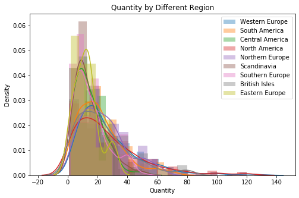


The idx_outs function is used to find and delete outliers using z-scores. Another subplot graph is then created to see the difference once the outliers found are gone. We can see a slightly more normal distribution in the graph below.


```python
for region_grps, grp_data in regions.items():
    idx_outs = find_outliers_z(grp_data)
    print(f'I found {idx_outs.sum()} outliers in {region_grps} using z-scores')
    regions[region_grps] = grp_data[-idx_outs]
```

    I found 14 outliers in Western Europe using z-scores
    I found 5 outliers in South America using z-scores
    I found 1 outliers in Central America using z-scores
    I found 10 outliers in North America using z-scores
    I found 0 outliers in Northern Europe using z-scores
    I found 1 outliers in Scandinavia using z-scores
    I found 1 outliers in Southern Europe using z-scores
    I found 5 outliers in British Isles using z-scores
    I found 0 outliers in Eastern Europe using z-scores


```python
fig, ax=plt.subplots(figsize = (8,5))
for region_grps, grp_data in regions.items():
    sns.distplot(grp_data, label=region_grps, ax=ax)
ax.legend()
ax.set(title ='Quantity by Different Region', ylabel = 'Density');
```


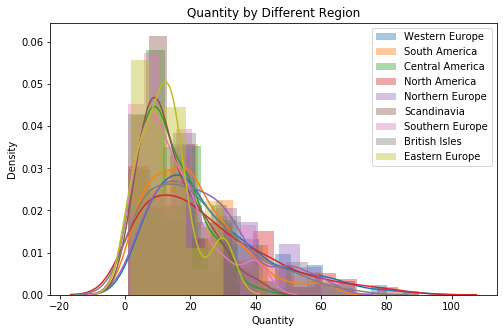


The p-value of each ship region is gathered and displayed below. All regions except Easter Europe passed the Normaltest p-value <0.05


```python
for k,v in regions.items():
    stat,p = stats.normaltest(v)
    print(f"The {k} Normaltest p-value = {round(p,4)}")
```

    The Western Europe Normaltest p-value = 0.0
    The South America Normaltest p-value = 0.0
    The Central America Normaltest p-value = 0.0426
    The North America Normaltest p-value = 0.0
    The Northern Europe Normaltest p-value = 0.0019
    The Scandinavia Normaltest p-value = 0.011
    The Southern Europe Normaltest p-value = 0.0001
    The British Isles Normaltest p-value = 0.0
    The Eastern Europe Normaltest p-value = 0.2396


```python
data = []
for k,v in regions.items():
    data.append(v)
data[0]
```


    0       12
    1       10
    2        5
    3        9
    4       40
    8        6
    9       15
    10      20
    11      40
    12      25
    13      40
    17      15
    18      21
    19      21
    20      20
    21      35
    22      25
    23      30
    29      50
    30      65
    31       6
    34      16
    35      50
    36      15
    37      21
    43      60
    44      28
    45      60
    46      36
    49      30
            ..
    2041     5
    2042     2
    2043    30
    2049    30
    2050    30
    2053    10
    2057    20
    2058    15
    2059    18
    2066    10
    2069    35
    2070    20
    2071    25
    2082     3
    2083    21
    2084     4
    2106     9
    2111    40
    2112    20
    2113    30
    2114    20
    2117     8
    2118    40
    2119    22
    2124    10
    2125    30
    2126     2
    2127    20
    2128    20
    2129    10
    Name: Quantity, Length: 731, dtype: int64


```python
stat,p = stats.levene(*data) 
print(f'Levenes test for equal variance p-value ={round(p,4)} therefore it does not have equal variance.')
```

    Levenes test for equal variance p-value =0.0 therefore it does not have equal variance.


```python
stat,p = stats.kruskal(*data)
print(f'Kruskal-Wallis t-test p-value ={round(p,4)} therefore the alternative hypothesis is statistically significance.')
```

    Kruskal-Wallis t-test p-value =0.0 therefore the alternative hypothesis is statistically significance.


With multiple different ship regions a tukey's test is done to see which groups are significantly different between the amount of items sold correlated with which region the order was shipped. A matrix table was then created comparing each group with another showing the mean difference.


```python
df_tukeys = prep_data_for_tukeys(regions)
df_tukeys.head()
df_tukeys.columns = ['ShipRegion','Quantity']
```


```python
from statsmodels.stats.multicomp import pairwise_tukeyhsd
model= pairwise_tukeyhsd(df_tukeys['ShipRegion'],df_tukeys['Quantity'])
model.summary()
df = pd.DataFrame(data=model._results_table.data[1:], columns=model._results_table.data[0])
df
```


<div>
<style scoped>
    .dataframe tbody tr th:only-of-type {
        vertical-align: middle;
    }

    .dataframe tbody tr th {
        vertical-align: top;
    }

    .dataframe thead th {
        text-align: right;
    }
</style>
<table border="1" class="dataframe">
  <thead>
    <tr style="text-align: right;">
      <th></th>
      <th>group1</th>
      <th>group2</th>
      <th>meandiff</th>
      <th>p-adj</th>
      <th>lower</th>
      <th>upper</th>
      <th>reject</th>
    </tr>
  </thead>
  <tbody>
    <tr>
      <th>0</th>
      <td>British Isles</td>
      <td>Central America</td>
      <td>-8.0298</td>
      <td>0.0096</td>
      <td>-14.9408</td>
      <td>-1.1188</td>
      <td>True</td>
    </tr>
    <tr>
      <th>1</th>
      <td>British Isles</td>
      <td>Eastern Europe</td>
      <td>-8.9497</td>
      <td>0.4395</td>
      <td>-21.8496</td>
      <td>3.9503</td>
      <td>False</td>
    </tr>
    <tr>
      <th>2</th>
      <td>British Isles</td>
      <td>North America</td>
      <td>2.7558</td>
      <td>0.5634</td>
      <td>-1.6172</td>
      <td>7.1288</td>
      <td>False</td>
    </tr>
    <tr>
      <th>3</th>
      <td>British Isles</td>
      <td>Northern Europe</td>
      <td>2.0490</td>
      <td>0.9000</td>
      <td>-3.4631</td>
      <td>7.5612</td>
      <td>False</td>
    </tr>
    <tr>
      <th>4</th>
      <td>British Isles</td>
      <td>Scandinavia</td>
      <td>-7.3274</td>
      <td>0.0313</td>
      <td>-14.3104</td>
      <td>-0.3444</td>
      <td>True</td>
    </tr>
    <tr>
      <th>5</th>
      <td>British Isles</td>
      <td>South America</td>
      <td>-1.2707</td>
      <td>0.9000</td>
      <td>-5.7705</td>
      <td>3.2291</td>
      <td>False</td>
    </tr>
    <tr>
      <th>6</th>
      <td>British Isles</td>
      <td>Southern Europe</td>
      <td>-6.8872</td>
      <td>0.0043</td>
      <td>-12.4787</td>
      <td>-1.2956</td>
      <td>True</td>
    </tr>
    <tr>
      <th>7</th>
      <td>British Isles</td>
      <td>Western Europe</td>
      <td>3.8876</td>
      <td>0.0755</td>
      <td>-0.1865</td>
      <td>7.9618</td>
      <td>False</td>
    </tr>
    <tr>
      <th>8</th>
      <td>Central America</td>
      <td>Eastern Europe</td>
      <td>-0.9199</td>
      <td>0.9000</td>
      <td>-14.6195</td>
      <td>12.7797</td>
      <td>False</td>
    </tr>
    <tr>
      <th>9</th>
      <td>Central America</td>
      <td>North America</td>
      <td>10.7856</td>
      <td>0.0010</td>
      <td>4.4301</td>
      <td>17.1411</td>
      <td>True</td>
    </tr>
    <tr>
      <th>10</th>
      <td>Central America</td>
      <td>Northern Europe</td>
      <td>10.0788</td>
      <td>0.0010</td>
      <td>2.8918</td>
      <td>17.2658</td>
      <td>True</td>
    </tr>
    <tr>
      <th>11</th>
      <td>Central America</td>
      <td>Scandinavia</td>
      <td>0.7024</td>
      <td>0.9000</td>
      <td>-7.6661</td>
      <td>9.0709</td>
      <td>False</td>
    </tr>
    <tr>
      <th>12</th>
      <td>Central America</td>
      <td>South America</td>
      <td>6.7590</td>
      <td>0.0314</td>
      <td>0.3156</td>
      <td>13.2024</td>
      <td>True</td>
    </tr>
    <tr>
      <th>13</th>
      <td>Central America</td>
      <td>Southern Europe</td>
      <td>1.1426</td>
      <td>0.9000</td>
      <td>-6.1055</td>
      <td>8.3907</td>
      <td>False</td>
    </tr>
    <tr>
      <th>14</th>
      <td>Central America</td>
      <td>Western Europe</td>
      <td>11.9174</td>
      <td>0.0010</td>
      <td>5.7637</td>
      <td>18.0711</td>
      <td>True</td>
    </tr>
    <tr>
      <th>15</th>
      <td>Eastern Europe</td>
      <td>North America</td>
      <td>11.7055</td>
      <td>0.0934</td>
      <td>-0.9056</td>
      <td>24.3166</td>
      <td>False</td>
    </tr>
    <tr>
      <th>16</th>
      <td>Eastern Europe</td>
      <td>Northern Europe</td>
      <td>10.9987</td>
      <td>0.1797</td>
      <td>-2.0512</td>
      <td>24.0486</td>
      <td>False</td>
    </tr>
    <tr>
      <th>17</th>
      <td>Eastern Europe</td>
      <td>Scandinavia</td>
      <td>1.6223</td>
      <td>0.9000</td>
      <td>-12.1137</td>
      <td>15.3583</td>
      <td>False</td>
    </tr>
    <tr>
      <th>18</th>
      <td>Eastern Europe</td>
      <td>South America</td>
      <td>7.6789</td>
      <td>0.6075</td>
      <td>-4.9767</td>
      <td>20.3345</td>
      <td>False</td>
    </tr>
    <tr>
      <th>19</th>
      <td>Eastern Europe</td>
      <td>Southern Europe</td>
      <td>2.0625</td>
      <td>0.9000</td>
      <td>-11.0211</td>
      <td>15.1461</td>
      <td>False</td>
    </tr>
    <tr>
      <th>20</th>
      <td>Eastern Europe</td>
      <td>Western Europe</td>
      <td>12.8373</td>
      <td>0.0392</td>
      <td>0.3267</td>
      <td>25.3479</td>
      <td>True</td>
    </tr>
    <tr>
      <th>21</th>
      <td>North America</td>
      <td>Northern Europe</td>
      <td>-0.7068</td>
      <td>0.9000</td>
      <td>-5.5041</td>
      <td>4.0905</td>
      <td>False</td>
    </tr>
    <tr>
      <th>22</th>
      <td>North America</td>
      <td>Scandinavia</td>
      <td>-10.0832</td>
      <td>0.0010</td>
      <td>-16.5169</td>
      <td>-3.6495</td>
      <td>True</td>
    </tr>
    <tr>
      <th>23</th>
      <td>North America</td>
      <td>South America</td>
      <td>-4.0266</td>
      <td>0.0148</td>
      <td>-7.6152</td>
      <td>-0.4379</td>
      <td>True</td>
    </tr>
    <tr>
      <th>24</th>
      <td>North America</td>
      <td>Southern Europe</td>
      <td>-9.6430</td>
      <td>0.0010</td>
      <td>-14.5313</td>
      <td>-4.7546</td>
      <td>True</td>
    </tr>
    <tr>
      <th>25</th>
      <td>North America</td>
      <td>Western Europe</td>
      <td>1.1318</td>
      <td>0.9000</td>
      <td>-1.9061</td>
      <td>4.1698</td>
      <td>False</td>
    </tr>
    <tr>
      <th>26</th>
      <td>Northern Europe</td>
      <td>Scandinavia</td>
      <td>-9.3764</td>
      <td>0.0020</td>
      <td>-16.6326</td>
      <td>-2.1202</td>
      <td>True</td>
    </tr>
    <tr>
      <th>27</th>
      <td>Northern Europe</td>
      <td>South America</td>
      <td>-3.3198</td>
      <td>0.4766</td>
      <td>-8.2329</td>
      <td>1.5934</td>
      <td>False</td>
    </tr>
    <tr>
      <th>28</th>
      <td>Northern Europe</td>
      <td>Southern Europe</td>
      <td>-8.9362</td>
      <td>0.0010</td>
      <td>-14.8655</td>
      <td>-3.0069</td>
      <td>True</td>
    </tr>
    <tr>
      <th>29</th>
      <td>Northern Europe</td>
      <td>Western Europe</td>
      <td>1.8386</td>
      <td>0.9000</td>
      <td>-2.6879</td>
      <td>6.3651</td>
      <td>False</td>
    </tr>
    <tr>
      <th>30</th>
      <td>Scandinavia</td>
      <td>South America</td>
      <td>6.0566</td>
      <td>0.0929</td>
      <td>-0.4639</td>
      <td>12.5772</td>
      <td>False</td>
    </tr>
    <tr>
      <th>31</th>
      <td>Scandinavia</td>
      <td>Southern Europe</td>
      <td>0.4402</td>
      <td>0.9000</td>
      <td>-6.8765</td>
      <td>7.7570</td>
      <td>False</td>
    </tr>
    <tr>
      <th>32</th>
      <td>Scandinavia</td>
      <td>Western Europe</td>
      <td>11.2150</td>
      <td>0.0010</td>
      <td>4.9806</td>
      <td>17.4495</td>
      <td>True</td>
    </tr>
    <tr>
      <th>33</th>
      <td>South America</td>
      <td>Southern Europe</td>
      <td>-5.6164</td>
      <td>0.0147</td>
      <td>-10.6185</td>
      <td>-0.6143</td>
      <td>True</td>
    </tr>
    <tr>
      <th>34</th>
      <td>South America</td>
      <td>Western Europe</td>
      <td>5.1584</td>
      <td>0.0010</td>
      <td>1.9406</td>
      <td>8.3761</td>
      <td>True</td>
    </tr>
    <tr>
      <th>35</th>
      <td>Southern Europe</td>
      <td>Western Europe</td>
      <td>10.7748</td>
      <td>0.0010</td>
      <td>6.1519</td>
      <td>15.3977</td>
      <td>True</td>
    </tr>
  </tbody>
</table>
</div>


```python
sig = df.loc[df['reject']==True][['group1', 'group2', 'p-adj']]
sig.columns = ['discount1','discount2','p-value']
sig
```


<div>
<style scoped>
    .dataframe tbody tr th:only-of-type {
        vertical-align: middle;
    }

    .dataframe tbody tr th {
        vertical-align: top;
    }

    .dataframe thead th {
        text-align: right;
    }
</style>
<table border="1" class="dataframe">
  <thead>
    <tr style="text-align: right;">
      <th></th>
      <th>discount1</th>
      <th>discount2</th>
      <th>p-value</th>
    </tr>
  </thead>
  <tbody>
    <tr>
      <th>0</th>
      <td>British Isles</td>
      <td>Central America</td>
      <td>0.0096</td>
    </tr>
    <tr>
      <th>4</th>
      <td>British Isles</td>
      <td>Scandinavia</td>
      <td>0.0313</td>
    </tr>
    <tr>
      <th>6</th>
      <td>British Isles</td>
      <td>Southern Europe</td>
      <td>0.0043</td>
    </tr>
    <tr>
      <th>9</th>
      <td>Central America</td>
      <td>North America</td>
      <td>0.0010</td>
    </tr>
    <tr>
      <th>10</th>
      <td>Central America</td>
      <td>Northern Europe</td>
      <td>0.0010</td>
    </tr>
    <tr>
      <th>12</th>
      <td>Central America</td>
      <td>South America</td>
      <td>0.0314</td>
    </tr>
    <tr>
      <th>14</th>
      <td>Central America</td>
      <td>Western Europe</td>
      <td>0.0010</td>
    </tr>
    <tr>
      <th>20</th>
      <td>Eastern Europe</td>
      <td>Western Europe</td>
      <td>0.0392</td>
    </tr>
    <tr>
      <th>22</th>
      <td>North America</td>
      <td>Scandinavia</td>
      <td>0.0010</td>
    </tr>
    <tr>
      <th>23</th>
      <td>North America</td>
      <td>South America</td>
      <td>0.0148</td>
    </tr>
    <tr>
      <th>24</th>
      <td>North America</td>
      <td>Southern Europe</td>
      <td>0.0010</td>
    </tr>
    <tr>
      <th>26</th>
      <td>Northern Europe</td>
      <td>Scandinavia</td>
      <td>0.0020</td>
    </tr>
    <tr>
      <th>28</th>
      <td>Northern Europe</td>
      <td>Southern Europe</td>
      <td>0.0010</td>
    </tr>
    <tr>
      <th>32</th>
      <td>Scandinavia</td>
      <td>Western Europe</td>
      <td>0.0010</td>
    </tr>
    <tr>
      <th>33</th>
      <td>South America</td>
      <td>Southern Europe</td>
      <td>0.0147</td>
    </tr>
    <tr>
      <th>34</th>
      <td>South America</td>
      <td>Western Europe</td>
      <td>0.0010</td>
    </tr>
    <tr>
      <th>35</th>
      <td>Southern Europe</td>
      <td>Western Europe</td>
      <td>0.0010</td>
    </tr>
  </tbody>
</table>
</div>


```python
ax = sns.barplot(data=df, x = df_tukeys['Quantity'], y= df_tukeys['ShipRegion'], ci=68)
ax.set_xticklabels(ax.get_xticklabels(),rotation=45, ha='right');
```


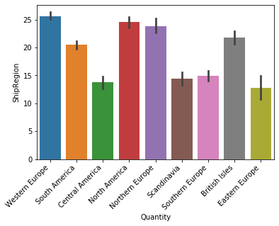


As shown in the bar graph above it is statistically significant that the customers order more of a product when the supplier region is in Western Europe, North America, and Northern Europe as well as the other regions except Eastern Europe. 

# Hypothesis 4

> Does the supplier region have a statistically significant effect on the total amount spent?

- $H_0$: The supplier region does not have an effect on the total amount spent.
- $H_A$: THe supplier region does have an effect on the total amount spent.

Explore the data and pull in the information needed to test the hypothesis. Another column was created to show the total spent. To find the total amount spent on an order we multiply the unit price by the number of items bought. After gathering the information a bar graph is made to have a general visual of the dataset pulled. 


```python
cur.execute('''SELECT *
               FROM "Order";''')
col_names = [x[0] for x in cur.description]
col_names
```


    ['Id',
     'CustomerId',
     'EmployeeId',
     'OrderDate',
     'RequiredDate',
     'ShippedDate',
     'ShipVia',
     'Freight',
     'ShipName',
     'ShipAddress',
     'ShipCity',
     'ShipRegion',
     'ShipPostalCode',
     'ShipCountry']


```python
df_order = pd.DataFrame(cur.fetchall(), columns = col_names)
```


```python
cur.execute('''SELECT *
               FROM OrderDetail;''')
col_names = [x[0] for x in cur.description]
df_details = pd.DataFrame(cur.fetchall(), columns = col_names)
df_details.head()
```


<div>
<style scoped>
    .dataframe tbody tr th:only-of-type {
        vertical-align: middle;
    }

    .dataframe tbody tr th {
        vertical-align: top;
    }

    .dataframe thead th {
        text-align: right;
    }
</style>
<table border="1" class="dataframe">
  <thead>
    <tr style="text-align: right;">
      <th></th>
      <th>Id</th>
      <th>OrderId</th>
      <th>ProductId</th>
      <th>UnitPrice</th>
      <th>Quantity</th>
      <th>Discount</th>
    </tr>
  </thead>
  <tbody>
    <tr>
      <th>0</th>
      <td>10248/11</td>
      <td>10248</td>
      <td>11</td>
      <td>14.0</td>
      <td>12</td>
      <td>0.0</td>
    </tr>
    <tr>
      <th>1</th>
      <td>10248/42</td>
      <td>10248</td>
      <td>42</td>
      <td>9.8</td>
      <td>10</td>
      <td>0.0</td>
    </tr>
    <tr>
      <th>2</th>
      <td>10248/72</td>
      <td>10248</td>
      <td>72</td>
      <td>34.8</td>
      <td>5</td>
      <td>0.0</td>
    </tr>
    <tr>
      <th>3</th>
      <td>10249/14</td>
      <td>10249</td>
      <td>14</td>
      <td>18.6</td>
      <td>9</td>
      <td>0.0</td>
    </tr>
    <tr>
      <th>4</th>
      <td>10249/51</td>
      <td>10249</td>
      <td>51</td>
      <td>42.4</td>
      <td>40</td>
      <td>0.0</td>
    </tr>
  </tbody>
</table>
</div>


```python
df = pd.merge(df_details,df_order, how='outer',left_on='OrderId', right_on='Id')
df.head()
```


<div>
<style scoped>
    .dataframe tbody tr th:only-of-type {
        vertical-align: middle;
    }

    .dataframe tbody tr th {
        vertical-align: top;
    }

    .dataframe thead th {
        text-align: right;
    }
</style>
<table border="1" class="dataframe">
  <thead>
    <tr style="text-align: right;">
      <th></th>
      <th>Id_x</th>
      <th>OrderId</th>
      <th>ProductId</th>
      <th>UnitPrice</th>
      <th>Quantity</th>
      <th>Discount</th>
      <th>Id_y</th>
      <th>CustomerId</th>
      <th>EmployeeId</th>
      <th>OrderDate</th>
      <th>RequiredDate</th>
      <th>ShippedDate</th>
      <th>ShipVia</th>
      <th>Freight</th>
      <th>ShipName</th>
      <th>ShipAddress</th>
      <th>ShipCity</th>
      <th>ShipRegion</th>
      <th>ShipPostalCode</th>
      <th>ShipCountry</th>
    </tr>
  </thead>
  <tbody>
    <tr>
      <th>0</th>
      <td>10248/11</td>
      <td>10248</td>
      <td>11</td>
      <td>14.0</td>
      <td>12</td>
      <td>0.0</td>
      <td>10248</td>
      <td>VINET</td>
      <td>5</td>
      <td>2012-07-04</td>
      <td>2012-08-01</td>
      <td>2012-07-16</td>
      <td>3</td>
      <td>32.38</td>
      <td>Vins et alcools Chevalier</td>
      <td>59 rue de l'Abbaye</td>
      <td>Reims</td>
      <td>Western Europe</td>
      <td>51100</td>
      <td>France</td>
    </tr>
    <tr>
      <th>1</th>
      <td>10248/42</td>
      <td>10248</td>
      <td>42</td>
      <td>9.8</td>
      <td>10</td>
      <td>0.0</td>
      <td>10248</td>
      <td>VINET</td>
      <td>5</td>
      <td>2012-07-04</td>
      <td>2012-08-01</td>
      <td>2012-07-16</td>
      <td>3</td>
      <td>32.38</td>
      <td>Vins et alcools Chevalier</td>
      <td>59 rue de l'Abbaye</td>
      <td>Reims</td>
      <td>Western Europe</td>
      <td>51100</td>
      <td>France</td>
    </tr>
    <tr>
      <th>2</th>
      <td>10248/72</td>
      <td>10248</td>
      <td>72</td>
      <td>34.8</td>
      <td>5</td>
      <td>0.0</td>
      <td>10248</td>
      <td>VINET</td>
      <td>5</td>
      <td>2012-07-04</td>
      <td>2012-08-01</td>
      <td>2012-07-16</td>
      <td>3</td>
      <td>32.38</td>
      <td>Vins et alcools Chevalier</td>
      <td>59 rue de l'Abbaye</td>
      <td>Reims</td>
      <td>Western Europe</td>
      <td>51100</td>
      <td>France</td>
    </tr>
    <tr>
      <th>3</th>
      <td>10249/14</td>
      <td>10249</td>
      <td>14</td>
      <td>18.6</td>
      <td>9</td>
      <td>0.0</td>
      <td>10249</td>
      <td>TOMSP</td>
      <td>6</td>
      <td>2012-07-05</td>
      <td>2012-08-16</td>
      <td>2012-07-10</td>
      <td>1</td>
      <td>11.61</td>
      <td>Toms Spezialitäten</td>
      <td>Luisenstr. 48</td>
      <td>Münster</td>
      <td>Western Europe</td>
      <td>44087</td>
      <td>Germany</td>
    </tr>
    <tr>
      <th>4</th>
      <td>10249/51</td>
      <td>10249</td>
      <td>51</td>
      <td>42.4</td>
      <td>40</td>
      <td>0.0</td>
      <td>10249</td>
      <td>TOMSP</td>
      <td>6</td>
      <td>2012-07-05</td>
      <td>2012-08-16</td>
      <td>2012-07-10</td>
      <td>1</td>
      <td>11.61</td>
      <td>Toms Spezialitäten</td>
      <td>Luisenstr. 48</td>
      <td>Münster</td>
      <td>Western Europe</td>
      <td>44087</td>
      <td>Germany</td>
    </tr>
  </tbody>
</table>
</div>


```python
df['Total Spent'] = df['UnitPrice'] * df['Quantity']
```


```python
ax = sns.barplot(data=df, x ='ShipRegion', y='Total Spent', ci=68)
ax.set_xticklabels(ax.get_xticklabels(),rotation=45, ha='right');
```


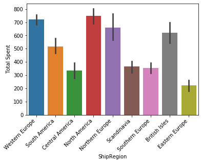


A regions dictionary was created to gather all ship regions with the total amount spent in each order to create a subplot to see a general visualization of the data distribution.


```python
regions = {}
for region_grps in df['ShipRegion'].unique():
    regions[region_grps]= df.groupby('ShipRegion').get_group(region_grps)['Total Spent']
regions
```


    {'Western Europe': 0        168.00
     1         98.00
     2        174.00
     3        167.40
     4       1696.00
     8        100.80
     9        234.00
     10       336.00
     11      2592.00
     12        50.00
     13      1088.00
     17        54.00
     18       403.20
     19       168.00
     20       304.00
     21       486.50
     22       380.00
     23      1320.00
     29       760.00
     30      1105.00
     31       153.60
     34       123.20
     35       780.00
     36       591.00
     37       252.00
     43       834.00
     44       100.80
     45      1242.00
     46       288.00
     49       936.00
              ...   
     2042      14.00
     2043     645.00
     2049     570.00
     2050    1317.00
     2053     210.00
     2057     760.00
     2058     480.00
     2059     324.00
     2066      45.00
     2069    2187.50
     2070     640.00
     2071     831.25
     2082      30.00
     2083     714.00
     2084     114.00
     2106      86.85
     2111     720.00
     2112     380.00
     2113     523.50
     2114     250.00
     2117     152.00
     2118     386.00
     2119     357.50
     2120    4322.50
     2124     190.00
     2125     360.00
     2126      36.00
     2127     500.00
     2128     465.00
     2129      92.00
     Name: Total Spent, Length: 745, dtype: float64,
     'South America': 5         77.00
     6       1484.00
     7        252.00
     14       200.00
     15       604.80
     16       640.00
     24       393.00
     25       124.80
     26       877.50
     27        86.40
     28       156.00
     38       160.00
     39       288.00
     55       990.00
     56       111.20
     91       248.00
     92       131.40
     93       952.00
     94        83.40
     104      556.00
     105      224.00
     106      144.00
     111      340.00
     112     1485.00
     113      240.00
     114      104.00
     115       96.00
     116      372.00
     117       84.80
     118     1296.00
              ...   
     1991      36.00
     1992      40.00
     1999     322.00
     2000    1080.00
     2044     912.00
     2045     432.00
     2046    1200.00
     2047     546.00
     2051     291.75
     2052     114.00
     2063     190.00
     2064     152.00
     2067    1380.00
     2068     285.00
     2072      25.00
     2073     280.00
     2074      67.50
     2075     210.00
     2076    1060.00
     2077     390.00
     2085     180.00
     2086     468.00
     2087    1190.00
     2101     103.56
     2102     149.00
     2107     364.80
     2108    1656.00
     2109     364.00
     2115     450.00
     2116      60.00
     Name: Total Spent, Length: 355, dtype: float64,
     'Central America': 32        80.00
     33        20.80
     74       372.00
     75        48.00
     119      600.00
     120       36.00
     121      175.50
     122       37.20
     150      480.00
     151      440.00
     152       34.40
     161       28.80
     162       60.00
     187      249.60
     188      509.60
     189      432.00
     192      112.00
     282      172.80
     283      396.00
     313      403.20
     600      223.20
     601      655.20
     602      308.70
     603       62.00
     667      199.50
     668      196.80
     669      420.00
     679      690.00
     680      191.25
     712       22.50
              ...   
     997       69.75
     998       70.00
     999      340.00
     1124      62.00
     1125      64.40
     1126     408.45
     1127     936.90
     1128      20.00
     1140      75.00
     1141      68.00
     1142     232.50
     1349     320.00
     1555     315.00
     1556     230.00
     1557     250.00
     1558     180.00
     1596     380.00
     1597     280.00
     1732     390.00
     1733      75.00
     1734      74.50
     1758      42.00
     1759      60.00
     1760      64.40
     1761     348.00
     1927    1060.00
     1928     136.00
     2110     360.00
     2121     210.00
     2122      90.00
     Name: Total Spent, Length: 72, dtype: float64,
     'North America': 40       204.00
     41       360.00
     42        60.80
     57       120.00
     58       556.00
     61        48.00
     62       388.80
     63       400.00
     64       667.20
     123      259.20
     124      468.00
     125      552.00
     126      571.20
     127       37.20
     153     1250.00
     154     2475.00
     155      432.00
     159      394.00
     160       30.00
     168      139.00
     169      197.00
     177     1024.00
     178      318.00
     179      985.00
     182       77.00
     183     2758.00
     184      288.00
     196      291.90
     197     1008.00
     198      288.00
              ...   
     2099      96.00
     2100     687.50
     2103      52.35
     2104     386.40
     2105     490.00
     2130     456.00
     2131      40.00
     2132      22.00
     2133      25.00
     2134      30.00
     2135      80.00
     2136      31.00
     2137      76.00
     2138      24.00
     2139      23.25
     2140      34.90
     2141      81.00
     2142      18.00
     2143      32.00
     2144      36.00
     2145      28.95
     2146      36.00
     2147      14.00
     2148      48.00
     2149      68.00
     2150      66.50
     2151      17.00
     2152      30.00
     2153      31.00
     2154      26.00
     Name: Total Spent, Length: 427, dtype: float64,
     'Northern Europe': 47        532.00
     48        192.50
     78        248.00
     79        660.00
     80        280.80
     81        300.00
     83         43.20
     84        384.00
     85        186.00
     209       380.00
     210       840.00
     211       724.50
     212       318.00
     249        16.00
     250       396.00
     316       403.20
     317       106.20
     318       252.00
     319        72.80
     343       103.20
     360      1814.40
     361       408.00
     401       600.00
     402       516.00
     403       504.00
     404       145.60
     449     10540.00
     450        19.20
     451       360.00
     452       364.00
               ...   
     1646      199.50
     1647      300.00
     1656      270.00
     1657      855.00
     1658      750.00
     1705      720.00
     1706      295.80
     1746      180.00
     1747     1756.00
     1753      620.00
     1754     1368.00
     1755       46.50
     1810      775.00
     1811      112.50
     1812      520.00
     1833       93.00
     1878      540.00
     1879      285.00
     1880      530.00
     1881      878.00
     1892      310.00
     1924     6189.50
     1925      337.75
     1926      990.00
     1943     1800.00
     1944      525.00
     1945      300.00
     1946      144.00
     2065      900.00
     2123      244.30
     Name: Total Spent, Length: 143, dtype: float64,
     'Scandinavia': 51       364.80
     59       456.00
     60       920.00
     190      516.00
     226      186.00
     227       80.00
     228      688.00
     367       54.00
     368      218.40
     369      528.00
     370      258.00
     438      372.00
     446      146.00
     447      262.00
     448      312.00
     500      393.00
     549      288.00
     550     1310.00
     551      570.00
     552      516.00
     718       36.00
     719      164.00
     737      144.00
     738       60.00
     739     1140.00
     814      315.00
     815      244.30
     816      504.00
     817      375.00
     818      108.00
              ...   
     1174     400.00
     1175     152.00
     1176      90.00
     1322     116.25
     1323     380.00
     1324    1375.00
     1398      22.35
     1399     760.00
     1400     350.00
     1520      18.40
     1521     144.00
     1522    2108.00
     1523     414.00
     1642     200.00
     1643     136.80
     1653     220.80
     1654     210.50
     1655     180.00
     1717     360.00
     1718     261.75
     1719      48.25
     1720     110.40
     1721     200.00
     1722     142.50
     1956      36.00
     1957     550.00
     1981     388.35
     1982     234.00
     2007     180.00
     2008     120.00
     Name: Total Spent, Length: 70, dtype: float64,
     'Southern Europe': 72        43.20
     73       264.00
     86         7.30
     87        21.60
     88        57.60
     89       124.20
     90        31.20
     107       59.00
     108       30.00
     140      408.00
     141      200.00
     147      588.00
     148      504.00
     149      150.00
     156      207.00
     157      262.00
     158       29.50
     206      422.40
     207      249.60
     208      310.00
     213      396.00
     214      672.00
     215      100.00
     235      316.80
     278       36.00
     279      118.00
     314       84.00
     315       52.00
     397       80.00
     398      763.20
              ...   
     1765      47.50
     1766      90.00
     1793     190.00
     1794     560.00
     1801     560.00
     1814     146.25
     1815    2120.00
     1816      96.00
     1821     110.00
     1853      68.00
     1867     280.00
     1960    1200.00
     1961    1237.90
     1962     196.00
     1966      54.00
     1967     342.00
     1968     306.00
     1969     600.00
     1970      45.00
     1976      90.00
     1977      56.00
     1978     190.00
     1979      25.00
     2009     500.00
     2010     530.00
     2040      60.00
     2088     136.00
     2089     130.00
     2091     328.00
     2092     180.00
     Name: Total Spent, Length: 137, dtype: float64,
     'British Isles': 109      240.00
     110      239.40
     134      608.00
     135      608.00
     136     1320.00
     137      591.00
     163      352.00
     164      600.00
     165       22.40
     166      736.00
     167       51.60
     180      156.80
     181      360.00
     185      154.00
     186       86.40
     191      144.00
     231      106.40
     232      250.00
     233      153.60
     234     2035.20
     284       90.00
     285      390.00
     295      778.40
     296      700.00
     297     2176.00
     311      864.00
     312       86.00
     334      848.00
     335      860.00
     341      728.00
              ...   
     1781     855.00
     1802      90.00
     1803     441.00
     1804     180.00
     1813     220.00
     1827    4050.00
     1828     625.00
     1901     628.20
     1902     500.00
     1903    1120.00
     1908    1800.00
     1909     276.00
     1910     696.00
     1983     187.50
     1984     304.00
     2001     120.00
     2002    1380.00
     2003     374.76
     2004      75.00
     2005     442.05
     2006    1075.00
     2060     450.00
     2061     640.50
     2078    1200.00
     2079     840.00
     2080    1700.00
     2081      45.00
     2093     420.00
     2094     736.00
     2095     289.50
     Name: Total Spent, Length: 190, dtype: float64,
     'Eastern Europe': 336     300.00
     337     159.00
     957     108.00
     958     190.00
     959     510.00
     1424    190.00
     1425     22.35
     1426    187.50
     1633     54.00
     1634    106.00
     1713    427.50
     1933     54.00
     1934    199.50
     1935    200.00
     1936    232.50
     2054    591.60
     Name: Total Spent, dtype: float64}


```python
fig, ax=plt.subplots(figsize = (8,5))
for region_grps, grp_data in regions.items():
    sns.distplot(grp_data, label=region_grps, ax=ax)
ax.legend()
ax.set(title ='Total Spent by Different Regions', ylabel = 'Density');
```


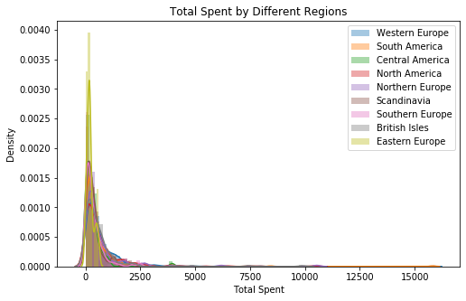


The idx_outs function is used to find and delete outliers using z-scores. Another subplot graph is then created to see the difference once the outliers found are gone. We can see a slightly more normal distribution in the graph below.


```python
for region_grps, grp_data in regions.items():
    idx_outs = find_outliers_z(grp_data)
    print(f'I found {idx_outs.sum()} outliers in {region_grps} using z-scores')
    regions[region_grps] = grp_data[-idx_outs]
```

    I found 11 outliers in Western Europe using z-scores
    I found 2 outliers in South America using z-scores
    I found 1 outliers in Central America using z-scores
    I found 8 outliers in North America using z-scores
    I found 2 outliers in Northern Europe using z-scores
    I found 1 outliers in Scandinavia using z-scores
    I found 3 outliers in Southern Europe using z-scores
    I found 4 outliers in British Isles using z-scores
    I found 0 outliers in Eastern Europe using z-scores


```python
fig, ax=plt.subplots(figsize = (8,5))
for region_grps, grp_data in regions.items():
    sns.distplot(grp_data, label=region_grps, ax=ax)
ax.legend()
ax.set(title ='Total Spent by Different Regions', ylabel = 'Density');
```


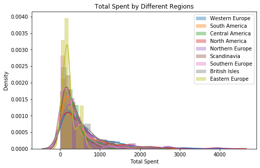


```python
for k,v in regions.items():
    stat,p = stats.normaltest(v)
    print(f"The {k} Normaltest p-value = {round(p,4)}")
```

    The Western Europe Normaltest p-value = 0.0
    The South America Normaltest p-value = 0.0
    The Central America Normaltest p-value = 0.0
    The North America Normaltest p-value = 0.0
    The Northern Europe Normaltest p-value = 0.0
    The Scandinavia Normaltest p-value = 0.0
    The Southern Europe Normaltest p-value = 0.0
    The British Isles Normaltest p-value = 0.0
    The Eastern Europe Normaltest p-value = 0.1024


The p-value of each ship region is gathered and displayed below. All regions except Easter Europe passed the Normaltest p-value <0.05


```python
data = []
for k,v in regions.items():
    data.append(v)
data[0]
```


    0        168.00
    1         98.00
    2        174.00
    3        167.40
    4       1696.00
    8        100.80
    9        234.00
    10       336.00
    11      2592.00
    12        50.00
    13      1088.00
    17        54.00
    18       403.20
    19       168.00
    20       304.00
    21       486.50
    22       380.00
    23      1320.00
    29       760.00
    30      1105.00
    31       153.60
    34       123.20
    35       780.00
    36       591.00
    37       252.00
    43       834.00
    44       100.80
    45      1242.00
    46       288.00
    49       936.00
             ...   
    2041      92.00
    2042      14.00
    2043     645.00
    2049     570.00
    2050    1317.00
    2053     210.00
    2057     760.00
    2058     480.00
    2059     324.00
    2066      45.00
    2069    2187.50
    2070     640.00
    2071     831.25
    2082      30.00
    2083     714.00
    2084     114.00
    2106      86.85
    2111     720.00
    2112     380.00
    2113     523.50
    2114     250.00
    2117     152.00
    2118     386.00
    2119     357.50
    2124     190.00
    2125     360.00
    2126      36.00
    2127     500.00
    2128     465.00
    2129      92.00
    Name: Total Spent, Length: 734, dtype: float64


```python
stat,p = stats.levene(*data) 
print(f'Levenes test for equal variance p-value ={round(p,4)} therefore it does not have equal variance.')
```

    Levenes test for equal variance p-value =0.0 therefore it does not have equal variance.


```python
stat,p = stats.kruskal(*data)
print(f'Kruskal-Wallis t-test p-value ={round(p,4)} therefore the alternative hypothesis is statistically significance.')
```

    Kruskal-Wallis t-test p-value =0.0 therefore the alternative hypothesis is statistically significance.


With multiple different ship regions a tukey's test is done to see which groups are significantly different between the amount of money spent correlated with which region the order was shipped. A matrix table was then created comparing each group with another showing the mean difference.


```python
df_tukeys = prep_data_for_tukeys(regions)
df_tukeys.head()
df_tukeys.columns = ['ShipRegion','Total Spent']
```


```python
from statsmodels.stats.multicomp import pairwise_tukeyhsd
model= pairwise_tukeyhsd(df_tukeys['ShipRegion'],df_tukeys['Total Spent'])
model.summary()
df = pd.DataFrame(data=model._results_table.data[1:], columns=model._results_table.data[0])
df
```


<div>
<style scoped>
    .dataframe tbody tr th:only-of-type {
        vertical-align: middle;
    }

    .dataframe tbody tr th {
        vertical-align: top;
    }

    .dataframe thead th {
        text-align: right;
    }
</style>
<table border="1" class="dataframe">
  <thead>
    <tr style="text-align: right;">
      <th></th>
      <th>group1</th>
      <th>group2</th>
      <th>meandiff</th>
      <th>p-adj</th>
      <th>lower</th>
      <th>upper</th>
      <th>reject</th>
    </tr>
  </thead>
  <tbody>
    <tr>
      <th>0</th>
      <td>British Isles</td>
      <td>Central America</td>
      <td>-209.6348</td>
      <td>0.1729</td>
      <td>-456.6540</td>
      <td>37.3843</td>
      <td>False</td>
    </tr>
    <tr>
      <th>1</th>
      <td>British Isles</td>
      <td>Eastern Europe</td>
      <td>-272.2816</td>
      <td>0.6387</td>
      <td>-733.6086</td>
      <td>189.0454</td>
      <td>False</td>
    </tr>
    <tr>
      <th>2</th>
      <td>British Isles</td>
      <td>North America</td>
      <td>127.0945</td>
      <td>0.2184</td>
      <td>-28.9196</td>
      <td>283.1086</td>
      <td>False</td>
    </tr>
    <tr>
      <th>3</th>
      <td>British Isles</td>
      <td>Northern Europe</td>
      <td>57.1591</td>
      <td>0.9000</td>
      <td>-140.5640</td>
      <td>254.8822</td>
      <td>False</td>
    </tr>
    <tr>
      <th>4</th>
      <td>British Isles</td>
      <td>Scandinavia</td>
      <td>-153.8169</td>
      <td>0.5896</td>
      <td>-403.4135</td>
      <td>95.7797</td>
      <td>False</td>
    </tr>
    <tr>
      <th>5</th>
      <td>British Isles</td>
      <td>South America</td>
      <td>-40.7325</td>
      <td>0.9000</td>
      <td>-201.1679</td>
      <td>119.7029</td>
      <td>False</td>
    </tr>
    <tr>
      <th>6</th>
      <td>British Isles</td>
      <td>Southern Europe</td>
      <td>-183.0726</td>
      <td>0.1065</td>
      <td>-383.7118</td>
      <td>17.5666</td>
      <td>False</td>
    </tr>
    <tr>
      <th>7</th>
      <td>British Isles</td>
      <td>Western Europe</td>
      <td>133.5464</td>
      <td>0.1011</td>
      <td>-11.8117</td>
      <td>278.9044</td>
      <td>False</td>
    </tr>
    <tr>
      <th>8</th>
      <td>Central America</td>
      <td>Eastern Europe</td>
      <td>-62.6468</td>
      <td>0.9000</td>
      <td>-552.6739</td>
      <td>427.3803</td>
      <td>False</td>
    </tr>
    <tr>
      <th>9</th>
      <td>Central America</td>
      <td>North America</td>
      <td>336.7293</td>
      <td>0.0010</td>
      <td>109.4754</td>
      <td>563.9833</td>
      <td>True</td>
    </tr>
    <tr>
      <th>10</th>
      <td>Central America</td>
      <td>Northern Europe</td>
      <td>266.7939</td>
      <td>0.0359</td>
      <td>9.1150</td>
      <td>524.4728</td>
      <td>True</td>
    </tr>
    <tr>
      <th>11</th>
      <td>Central America</td>
      <td>Scandinavia</td>
      <td>55.8179</td>
      <td>0.9000</td>
      <td>-243.5188</td>
      <td>355.1546</td>
      <td>False</td>
    </tr>
    <tr>
      <th>12</th>
      <td>Central America</td>
      <td>South America</td>
      <td>168.9023</td>
      <td>0.3575</td>
      <td>-61.4094</td>
      <td>399.2140</td>
      <td>False</td>
    </tr>
    <tr>
      <th>13</th>
      <td>Central America</td>
      <td>Southern Europe</td>
      <td>26.5622</td>
      <td>0.9000</td>
      <td>-233.3609</td>
      <td>286.4854</td>
      <td>False</td>
    </tr>
    <tr>
      <th>14</th>
      <td>Central America</td>
      <td>Western Europe</td>
      <td>343.1812</td>
      <td>0.0010</td>
      <td>123.1064</td>
      <td>563.2561</td>
      <td>True</td>
    </tr>
    <tr>
      <th>15</th>
      <td>Eastern Europe</td>
      <td>North America</td>
      <td>399.3761</td>
      <td>0.1311</td>
      <td>-51.6766</td>
      <td>850.4288</td>
      <td>False</td>
    </tr>
    <tr>
      <th>16</th>
      <td>Eastern Europe</td>
      <td>Northern Europe</td>
      <td>329.4407</td>
      <td>0.4155</td>
      <td>-137.6809</td>
      <td>796.5623</td>
      <td>False</td>
    </tr>
    <tr>
      <th>17</th>
      <td>Eastern Europe</td>
      <td>Scandinavia</td>
      <td>118.4647</td>
      <td>0.9000</td>
      <td>-372.8667</td>
      <td>609.7962</td>
      <td>False</td>
    </tr>
    <tr>
      <th>18</th>
      <td>Eastern Europe</td>
      <td>South America</td>
      <td>231.5491</td>
      <td>0.7866</td>
      <td>-221.0519</td>
      <td>684.1501</td>
      <td>False</td>
    </tr>
    <tr>
      <th>19</th>
      <td>Eastern Europe</td>
      <td>Southern Europe</td>
      <td>89.2090</td>
      <td>0.9000</td>
      <td>-379.1543</td>
      <td>557.5724</td>
      <td>False</td>
    </tr>
    <tr>
      <th>20</th>
      <td>Eastern Europe</td>
      <td>Western Europe</td>
      <td>405.8280</td>
      <td>0.1114</td>
      <td>-41.6506</td>
      <td>853.3066</td>
      <td>False</td>
    </tr>
    <tr>
      <th>21</th>
      <td>North America</td>
      <td>Northern Europe</td>
      <td>-69.9354</td>
      <td>0.9000</td>
      <td>-242.3314</td>
      <td>102.4605</td>
      <td>False</td>
    </tr>
    <tr>
      <th>22</th>
      <td>North America</td>
      <td>Scandinavia</td>
      <td>-280.9114</td>
      <td>0.0048</td>
      <td>-510.9645</td>
      <td>-50.8584</td>
      <td>True</td>
    </tr>
    <tr>
      <th>23</th>
      <td>North America</td>
      <td>South America</td>
      <td>-167.8271</td>
      <td>0.0016</td>
      <td>-295.7546</td>
      <td>-39.8995</td>
      <td>True</td>
    </tr>
    <tr>
      <th>24</th>
      <td>North America</td>
      <td>Southern Europe</td>
      <td>-310.1671</td>
      <td>0.0010</td>
      <td>-485.8999</td>
      <td>-134.4343</td>
      <td>True</td>
    </tr>
    <tr>
      <th>25</th>
      <td>North America</td>
      <td>Western Europe</td>
      <td>6.4519</td>
      <td>0.9000</td>
      <td>-101.9681</td>
      <td>114.8718</td>
      <td>False</td>
    </tr>
    <tr>
      <th>26</th>
      <td>Northern Europe</td>
      <td>Scandinavia</td>
      <td>-210.9760</td>
      <td>0.2238</td>
      <td>-471.1268</td>
      <td>49.1748</td>
      <td>False</td>
    </tr>
    <tr>
      <th>27</th>
      <td>Northern Europe</td>
      <td>South America</td>
      <td>-97.8916</td>
      <td>0.7051</td>
      <td>-274.2988</td>
      <td>78.5155</td>
      <td>False</td>
    </tr>
    <tr>
      <th>28</th>
      <td>Northern Europe</td>
      <td>Southern Europe</td>
      <td>-240.2317</td>
      <td>0.0144</td>
      <td>-453.8577</td>
      <td>-26.6057</td>
      <td>True</td>
    </tr>
    <tr>
      <th>29</th>
      <td>Northern Europe</td>
      <td>Western Europe</td>
      <td>76.3873</td>
      <td>0.8664</td>
      <td>-86.4283</td>
      <td>239.2029</td>
      <td>False</td>
    </tr>
    <tr>
      <th>30</th>
      <td>Scandinavia</td>
      <td>South America</td>
      <td>113.0844</td>
      <td>0.8363</td>
      <td>-119.9897</td>
      <td>346.1584</td>
      <td>False</td>
    </tr>
    <tr>
      <th>31</th>
      <td>Scandinavia</td>
      <td>Southern Europe</td>
      <td>-29.2557</td>
      <td>0.9000</td>
      <td>-291.6297</td>
      <td>233.1183</td>
      <td>False</td>
    </tr>
    <tr>
      <th>32</th>
      <td>Scandinavia</td>
      <td>Western Europe</td>
      <td>287.3633</td>
      <td>0.0021</td>
      <td>64.3992</td>
      <td>510.3273</td>
      <td>True</td>
    </tr>
    <tr>
      <th>33</th>
      <td>South America</td>
      <td>Southern Europe</td>
      <td>-142.3401</td>
      <td>0.2523</td>
      <td>-322.0096</td>
      <td>37.3295</td>
      <td>False</td>
    </tr>
    <tr>
      <th>34</th>
      <td>South America</td>
      <td>Western Europe</td>
      <td>174.2789</td>
      <td>0.0010</td>
      <td>59.5880</td>
      <td>288.9699</td>
      <td>True</td>
    </tr>
    <tr>
      <th>35</th>
      <td>Southern Europe</td>
      <td>Western Europe</td>
      <td>316.6190</td>
      <td>0.0010</td>
      <td>150.2742</td>
      <td>482.9637</td>
      <td>True</td>
    </tr>
  </tbody>
</table>
</div>


```python
sig = df.loc[df['reject']==True][['group1', 'group2', 'p-adj']]
sig.columns = ['discount1','discount2','p-value']
sig
```


<div>
<style scoped>
    .dataframe tbody tr th:only-of-type {
        vertical-align: middle;
    }

    .dataframe tbody tr th {
        vertical-align: top;
    }

    .dataframe thead th {
        text-align: right;
    }
</style>
<table border="1" class="dataframe">
  <thead>
    <tr style="text-align: right;">
      <th></th>
      <th>discount1</th>
      <th>discount2</th>
      <th>p-value</th>
    </tr>
  </thead>
  <tbody>
    <tr>
      <th>9</th>
      <td>Central America</td>
      <td>North America</td>
      <td>0.0010</td>
    </tr>
    <tr>
      <th>10</th>
      <td>Central America</td>
      <td>Northern Europe</td>
      <td>0.0359</td>
    </tr>
    <tr>
      <th>14</th>
      <td>Central America</td>
      <td>Western Europe</td>
      <td>0.0010</td>
    </tr>
    <tr>
      <th>22</th>
      <td>North America</td>
      <td>Scandinavia</td>
      <td>0.0048</td>
    </tr>
    <tr>
      <th>23</th>
      <td>North America</td>
      <td>South America</td>
      <td>0.0016</td>
    </tr>
    <tr>
      <th>24</th>
      <td>North America</td>
      <td>Southern Europe</td>
      <td>0.0010</td>
    </tr>
    <tr>
      <th>28</th>
      <td>Northern Europe</td>
      <td>Southern Europe</td>
      <td>0.0144</td>
    </tr>
    <tr>
      <th>32</th>
      <td>Scandinavia</td>
      <td>Western Europe</td>
      <td>0.0021</td>
    </tr>
    <tr>
      <th>34</th>
      <td>South America</td>
      <td>Western Europe</td>
      <td>0.0010</td>
    </tr>
    <tr>
      <th>35</th>
      <td>Southern Europe</td>
      <td>Western Europe</td>
      <td>0.0010</td>
    </tr>
  </tbody>
</table>
</div>


```python
ax = sns.barplot(data=df, x = df_tukeys['Total Spent'], y= df_tukeys['ShipRegion'], ci=68)
ax.set_xticklabels(ax.get_xticklabels(),rotation=45, ha='right');
```


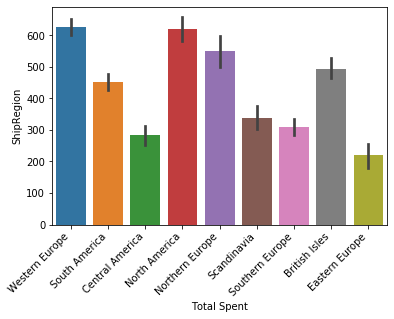


As shown in the bar graph above it is statistically significant that the customers spend more money in an order when the supplier region is in Western Europe, North America, and Northern Europe as well as the other regions except Eastern Europe. 

# Conlusion

In conclusion, discounting items at 5%, 15%, 20%, and 25% are statistically significant in increasing the quantity of products sold in an order with a p-value of 0.001. To increase the amount spent in an order the only discounts that are statistically significant are at 5% and 25%. The region at where the products are shipped has a statistical significance in the amount of products sold as well as the amount of money spent in all of the regions except Eastern Europe. Eastern Europe has p-value at 0.1024 which does not pass the tukey's test.

# Recommendations 

1. Discount products at 5% to increase number of products sold.
2. Increase supplier regions in Western Europe, North America and Northern Europe.
3. Increase marketing efforts in Eastern Europe.
